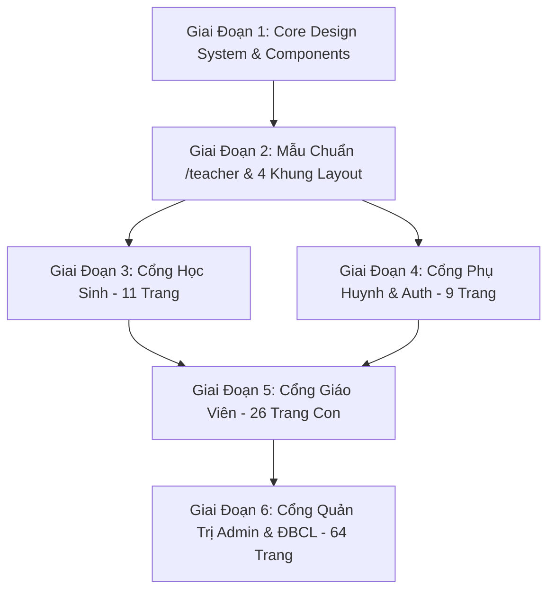

# KẾ HOẠCH TỔNG THỂ RÀ SOÁT & THIẾT KẾ LẠI GIAO DIỆN HỆ THỐNG SKYLINE SURVEY
### Chuẩn Mực Trường Học Quốc Tế • Thấu Cảm Sư Phạm • Gọn Đẹp • Không In Đậm • Không Trùng Lặp

---

> **Mục tiêu**: Nâng cấp toàn diện trải nghiệm thị giác và công thái học cho toàn bộ 111 trang trong dự án **Skyline Survey**, tạo dựng diện mạo chuẩn trường học quốc tế đẳng cấp, thân thiện, tràn đầy cảm hứng sư phạm, loại bỏ hoàn toàn cảm giác nặng nề, rối mắt và lặp lại chức năng; đồng thời **bảo lưu nguyên vẹn 100% chức năng, đường dẫn route, logic nghiệp vụ và dữ liệu hiện có**.

---

## MỤC LỤC
1. [Triết Lý Thiết Kế: "International School Empathy"](#1-triết-lý-thiết-kế-international-school-empathy)
2. [Bộ Quy Chuẩn Giao Diện Mới (Design System Standards)](#2-bộ-quy-chuẩn-giao-diện-mới-design-system-standards)
   - [2.1. Quy chuẩn Typography (Tuyệt đối không dùng font in đậm)](#21-quy-chuẩn-typography-tuyệt-đối-không-dùng-font-in-đậm)
   - [2.2. Bảng màu trường học quốc tế (Color Palette)](#22-bảng-màu-trường-học-quốc-tế-color-palette)
   - [2.3. Bố cục, Bề mặt & Khoảng thở (Surfaces & Breathing Room)](#23-bố-cục-bề-mặt--khoảng-thở-surfaces--breathing-room)
    - [2.4. Chuẩn Hóa Bộ Khung Bố Cục & 4 Mẫu Card Dùng Chung Toàn Hệ Thống](#24-chuẩn-hóa-bộ-khung-bố-cục--4-mẫu-card-dùng-chung-toàn-hệ-thống)
   - [2.5. Quy Chuẩn Đồng Nhất Màu Nền Khung Title & Header Bảng Dữ Liệu](#25-quy-chuẩn-đồng-nhất-màu-nền-khung-title--header-bảng-dữ-liệu)
   - [2.6. Nguyên tắc trừ khử trùng lặp 100% (Zero-Redundancy)](#26-nguyên-tắc-trừ-khử-trùng-lặp-100-zero-redundancy)
3. [7 Cải Tiến Giao Diện Nâng Cao (Bảo Lưu 100% Chức Năng)](#3-7-cải-tiến-giao-diện-nâng-cao-bảo-lưu-100-chức-năng)
4. [Mẫu Chuẩn Thực Tế (Benchmark Page): Trang Dashboard Giáo Viên (`/teacher`)](#4-mẫu-chuẩn-thực-tế-benchmark-page-trang-dashboard-giáo-viên-teacher)
5. [Lộ Trình Triển Khai Chi Tiết Toàn Bộ 111 Trang (6 Giai Đoạn)](#5-lộ-trình-triển-khai-chi-tiết-toàn-bộ-111-trang-6-giai-đoạn)
6. [Kế Hoạch Xác Minh & Tiêu Chuẩn Nghiệm Thu](#6-kế-hoạch-xác-minh--tiêu-chuẩn-nghiệm-thu)

---

## 1. Triết Lý Thiết Kế: "International School Empathy"

Lấy cảm hứng từ chuẩn mực của các tổ chức giáo dục quốc tế hàng đầu (IB World Schools, Nordic Education, Cambridge), phong cách mới của **Skyline Survey** được định vị theo phương châm **"Thấu cảm Sư phạm Trường Quốc tế"**:

* **Thân thiện & Nhân văn**: Mọi thông điệp, lời chào, trạng thái rỗng và modal thông báo đều mang tính nâng đỡ, khích lệ tinh thần giáo viên, học sinh và phụ huynh.
* **Thanh lịch & Tinh tế**: Không sử dụng các khối màu chát chúa, không dùng font chữ đen đậm to dày gây căng thẳng mắt.
* **Gọn gàng & Khoa học**: Tổ chức thông tin có phân cấp rõ ràng theo mô hình nhận thức thị giác F-Pattern / Z-Pattern, đảm bảo người dùng nắm bắt dữ liệu quan trọng nhất trong 3 giây đầu tiên.
* **Đơn nhất (Single Point of Truth)**: Mỗi chức năng điều khiển (chọn năm học, tìm kiếm, làm mới) chỉ xuất hiện tại đúng 1 vị trí tối ưu nhất, không lặp lại gây rối rắm.

---

## 2. Bộ Quy Chuẩn Giao Diện Mới (Design System Standards)

### 2.1. Quy Chuẩn Typography (Tuyệt Đối Không Dùng Font In Đậm)

Hệ thống sử dụng font **`Be Vietnam Pro`** chuẩn hiển thị tiếng Việt xuất sắc. Toàn bộ dự án tuân thủ nghiêm ngặt:

> **LỆNH CẤM FONT IN ĐẬM**:
> - **Tuyệt đối cấm sử dụng**: `font-bold` (700), `font-extrabold` (800), `font-black` (900), `font-semibold` (600) ép cứng.
> - **Chỉ sử dụng 2 cấp trọng số duy nhất**:
>   - **`font-normal` (Weight 400)**: Áp dụng cho toàn bộ văn bản nội dung, đoạn văn, dữ liệu bảng biểu, chú thích, placeholder.
>   - **`font-medium` (Weight 500)**: Áp dụng cho tiêu đề trang, tiêu đề thẻ, tên nút bấm, thẻ tab, tên cột bảng và chỉ số KPI.

#### Bảng Ma Trận Phân Cấp Typography Chuẩn Mới:

| Cấp Độ Phân Cấp | Cỡ Chữ (Desktop / Mobile) | Trọng Số (Weight) | Độ Giãn Dòng | Màu Sắc Áp Dụng | Mục Đích Sử Dụng |
| :--- | :--- | :--- | :--- | :--- | :--- |
| **Tiêu đề trang (H1)** | `text-xl sm:text-2xl` (20-24px) | `font-medium` (500) | `leading-snug` | `text-slate-800` | Tiêu đề đầu trang PageHeader |
| **Tiêu đề thẻ (H2)** | `text-base sm:text-lg` (16-18px) | `font-medium` (500) | `leading-tight` | `text-slate-800` | Tiêu đề khối widget / Card |
| **Chỉ số lớn (KPI)** | `text-2xl sm:text-3xl` (24-28px) | `font-medium` (500) | `leading-tight` | `text-slate-800` | Con số thống kê tổng thể |
| **Nút bấm & Tab** | `text-xs sm:text-sm` (12-13px) | `font-medium` (500) | `leading-none` | `text-white` / `text-slate-700` | Nút hành động, tab chuyển đổi |
| **Nhãn & Badge** | `text-[11px] sm:text-xs` (11-12px) | `font-medium` (500) | `leading-none` | `text-{color}-700` (nền pastel) | Huy hiệu trạng thái, phân loại |
| **Nội dung thường** | `text-xs sm:text-sm` (12-13px) | `font-normal` (400) | `leading-relaxed` | `text-slate-600` | Mô tả, ghi chú, dữ liệu ô bảng |
| **Chú thích / Footer** | `text-[10px] sm:text-xs` (10-11px) | `font-normal` (400) | `leading-normal` | `text-slate-400` | Thời gian, thông số kỹ thuật |

---

### 2.2. Bảng Màu Trường Học Quốc Tế (Color Palette)

Toàn bộ ứng dụng sử dụng bảng màu HSL hài hòa, tạo cảm giác thư thái và đẳng cấp:

```
┌────────────────────────────────────────────────────────────────────────────────────────┐
│                                BẢNG MÀU CHUẨN SKY-LINE                                 │
├───────────────────────┬──────────────┬──────────────────┬──────────────────────────────┤
│ Nhóm Màu              │ Mã Hex / CSS │ Sắc Thái Nền     │ Ứng Dụng Thực Tế             │
├───────────────────────┼──────────────┼──────────────────┼──────────────────────────────┤
│ 1. Canvas Mist (Nền)  │ #F8FAFC      │ bg-[#F8FAFC]     │ Nền toàn bộ trang ứng dụng   │
│ 2. Scholastic Sky     │ #0284C7      │ bg-sky-50/70     │ Màu thương hiệu, nút chính   │
│ 3. Academic Navy      │ #0F2942      │ bg-slate-900     │ Sidebar, biểu tượng học viện │
│ 4. Inspiring Emerald  │ #059669      │ bg-emerald-50/70 │ Hoàn thành, tích cực, đạt    │
│ 5. Sunshine Amber     │ #D97706      │ bg-amber-50/70   │ Nhắc nhở, hướng nghiệp, TKB  │
│ 6. Compassion Rose    │ #E11D48      │ bg-rose-50/60    │ Cần bồi dưỡng, hỗ trợ tâm lý │
│ 7. Surface White      │ #FFFFFF      │ bg-white         │ Bề mặt card, modal, bảng     │
└───────────────────────┴──────────────┴──────────────────┴──────────────────────────────┘
```

---

### 2.3. Bố Cục, Bề Mặt & Khoảng Thở (Surfaces & Breathing Room)

* **Hình khối Card**: Nền trắng tinh khôi `#FFFFFF`, bo góc mềm mại `rounded-2xl` (16px), đường viền mảnh `border border-slate-200/60`.
* **Bóng đổ (Elevation)**: Chỉ dùng đổ bóng vi mô `shadow-2xs` (0 1px 2px rgba(0,0,0,0.03)) và `shadow-xs`. Tuyệt đối tránh bóng đổ đen thô cứng.
* **Vi tương tác (Micro-interactions)**: Khi rê chuột vào card, phần tử chỉ nhấc nhẹ 1-2px (`hover:-translate-y-0.5 hover:shadow-xs transition-all duration-200`) tạo cảm giác sống động và mượt mà.
* **Bảng biểu (Data Tables)**:
  * Khoảng cách hàng thoáng đãng (padding `py-3 px-4`).
  * Header bảng dùng chữ xám nhạt `font-medium text-slate-500 uppercase tracking-normal bg-slate-50/80`.
  * Hàng dữ liệu có hiệu ứng hover êm dịu `hover:bg-sky-50/30`.

---

### 2.4. Chuẩn Hóa Bộ Khung Bố Cục & 4 Mẫu Card Dùng Chung Toàn Hệ Thống

Để đảm bảo **100% các trang trong dự án đồng nhất về bố cục, màu sắc và cấu trúc card**, toàn bộ hệ thống tuân theo quy chuẩn kiến trúc sau:

#### A. Khung Bố Cục Trang Chuẩn (Standard Page Structure)
Mọi trang con trong cả 5 phân hệ đều được cấu trúc theo 4 tầng đồng nhất:
```
┌────────────────────────────────────────────────────────────────────────────────────────┐
│ TẦNG 1: HEADER TRANG (PageHeader)                                                      │
│ Breadcrumbs: Trang chủ / Quản lý lớp / Lớp 10A1                                       │
│ [H1] Tiêu đề trang (font-medium text-slate-800 text-xl)      [Nhóm Nút Thao Tác Chính] │
│ Mô tả ngắn công tác nghiệp vụ (font-normal text-slate-500 text-xs)                    │
├────────────────────────────────────────────────────────────────────────────────────────┤
│ TẦNG 2: THANH BỘ LỌC & TÌM KIẾM CHUẨN (Filter & Search Bar)                           │
│ [🔍 Ô tìm kiếm nhanh]   [Bộ lọc Cơ sở ▼]   [Bộ lọc Khối/Lớp ▼]   [Bộ lọc Trạng thái ▼] │
├────────────────────────────────────────────────────────────────────────────────────────┤
│ TẦNG 3: VÙNG NỘI DUNG CHÍNH (Card Grid hoặc Data Table)                                │
│ Sử dụng 4 loại Card chuẩn hóa hoặc Bảng dữ liệu đồng bộ viền mảnh & padding           │
├────────────────────────────────────────────────────────────────────────────────────────┤
│ TẦNG 4: THANH PHÂN TRANG / FOOTER NỘI DUNG (Pagination & Summary)                      │
│ Hiển thị: 1 - 20 trong số 120 mục                          [ < Trang 1 / 6 > ]        │
└────────────────────────────────────────────────────────────────────────────────────────┘
```

#### B. 4 Mẫu Card Đồng Nhất Cho Toàn Bộ 111 Trang:

1. **`BaseCard` (Thẻ Bề Mặt Chuẩn)**:
   - Dùng cho: Khối nội dung tổng quát, form nhập liệu, chi tiết hồ sơ, bảng dữ liệu bọc ngoài.
   - Đặc tính: `bg-white rounded-2xl border border-slate-200/60 p-5 sm:p-6 shadow-2xs`.
   - Header thẻ: Có gạch ngăn nhẹ `border-b border-slate-100 pb-3 mb-4` với tiêu đề `font-medium text-slate-800 text-sm sm:text-base`.

2. **`KPICard` (Thẻ Chỉ Số Thống Kê)**:
   - Dùng cho: Các màn hình Dashboard (Admin, Giáo viên, Phụ huynh, Học sinh).
   - Đặc tính kích thước: Chiều cao và khoảng đệm hoàn toàn đồng nhất (`p-4 sm:p-5 flex flex-col justify-between min-h-[135px]`).
   - Cấu trúc 3 phần chuẩn:
     - *Hàng trên*: Vòng tròn icon pastel (32x32px) + Huy hiệu trạng thái vi mô (`Badge font-medium`).
     - *Hàng giữa*: Số liệu lớn `text-2xl sm:text-3xl font-medium text-slate-800` + đơn vị phụ `text-xs font-normal text-slate-400`. Nhãn danh mục `text-xs font-normal text-slate-500 mt-1`.
     - *Hàng dưới*: Đường kẻ mảnh `border-t border-slate-100 pt-2.5 mt-2` với liên kết drill-down màu Sky Blue `text-xs font-normal text-sky-600 flex items-center justify-between group-hover:underline`.

3. **`ActionCard` / `QuickActionCard` (Thẻ Tác Vụ Thường Nhật)**:
   - Dùng cho: Lối tắt công tác, các module danh mục chức năng.
   - Định dạng: Dạng thẻ ngang compact hoặc thẻ lưới bo góc mềm:
     - Icon tinh xảo bên trái trong hộp vuông bo góc (`w-9 h-9 rounded-xl bg-sky-50 text-[#0284C7]`).
     - Tên chức năng: `text-xs sm:text-sm font-medium text-slate-800`.
     - Dòng mô tả ngắn: `text-xs font-normal text-slate-500 line-clamp-1 mt-0.5`.
     - Mũi tên điều hướng vi mô `ChevronRight` màu nhạt `text-slate-300 group-hover:text-sky-500 group-hover:translate-x-0.5 transition-all`.

4. **`HeroWelcomeCard` (Thẻ Chào Mừng & Banner Cảm Xúc)**:
   - Dùng cho: Đầu trang của mỗi phân hệ người dùng.
   - Định dạng: Nền gradient êm dịu `bg-gradient-to-r from-sky-50/80 via-white to-sky-50/60`, viền `border border-sky-100/90 rounded-2xl p-5 sm:p-6`.
   - Chữ tiêu đề `font-medium text-slate-800 text-xl`, avatar mềm mại, lời chào thấu cảm theo khung giờ và câu châm ngôn sư phạm viết tay thanh tao.

---

### 2.5. Quy Chuẩn Đồng Nhất Màu Nền Khung Title & Header Bảng Dữ Liệu

Nhằm khắc phục triệt để tình trạng mỗi trang dùng một kiểu màu nền bảng khác nhau (nơi dùng nền đen xám `bg-slate-800`, nơi dùng xanh đậm `bg-[#003B3A]`, nơi dùng xanh cyan `bg-[#48BFE3]` hay gradient chói lóa), toàn bộ 111 trang được **quy chuẩn hóa đồng nhất 100% màu nền cho khung tiêu đề bảng và tiêu đề cột**:

#### 1. Khung Tiêu Đề Bọc Ngoài Bảng (Table Container Title Frame / Card Header):
* **Màu nền quy chuẩn**: `bg-slate-50/80` (hoặc `bg-[#F8FAFC]` đồng bộ với Canvas Mist).
* **Đường viền ngăn cách**: `border-b border-slate-200/70` sắc nét, thanh mảnh.
* **Cấu trúc khung tiêu đề chuẩn**:
  ```tsx
  <div className="flex items-center justify-between px-5 py-3.5 bg-slate-50/80 border-b border-slate-200/70 rounded-t-2xl">
    <div className="flex items-center gap-2.5">
      <div className="w-8 h-8 rounded-xl bg-sky-50 text-[#0284C7] flex items-center justify-center border border-sky-200/60 shadow-2xs">
        <TableIcon className="w-4 h-4" />
      </div>
      <div>
        <h3 className="text-sm font-medium text-slate-800 tracking-normal">
          {tableTitle}
        </h3>
        {tableSubtitle && (
          <p className="text-[11px] font-normal text-slate-400 mt-0.5">
            {tableSubtitle}
          </p>
        )}
      </div>
    </div>
    {/* Nhóm nút hành động nhanh góc phải (Xuất Excel, Thêm mới, Lọc nhanh) */}
    <div className="flex items-center gap-2">
      {headerRightActions}
    </div>
  </div>
  ```
* **Lợi ích**: Tạo một khối tiêu đề rõ ràng, thanh nhã, phân biệt rành mạch giữa phần *Tiêu đề điều khiển* và phần *Bảng dữ liệu bên dưới*, không gây mỏi mắt khi làm việc lâu.

#### 2. Hàng Tiêu Đề Cột Bảng Dữ Liệu (`thead` / Column Header):
* **Màu nền quy chuẩn**: `bg-slate-50/90` (hoặc `bg-[#F1F5F9]/70` khi bảng nằm trong thẻ lồng).
* **Đường viền phân tách**: `border-b border-slate-200/70`.
* **Chữ tiêu đề cột**: `text-slate-500 font-medium text-xs tracking-normal whitespace-nowrap px-4 py-3`.
* **QUY ĐỊNH BẮT BUỘC**:
  - **CẤM**: `bg-slate-800`, `bg-[#003B3A]`, `bg-[#001D1C]`, `bg-[#7400B8]`, `bg-[#48BFE3]` trên hàng `thead`.
  - **CẤM**: `font-bold`, `font-extrabold`, `font-black` trên các ô `th`.
  - **ĐẢM BẢO**: Tất cả 111 trang đều có giao diện bảng trắng sáng, thanh thoát, theo phong cách các trường học quốc tế chuẩn mực.

---

### 2.6. Nguyên Tắc Trừ Khử Trùng Lặp 100% (Zero-Redundancy)

1. **Một Điểm Điều Khiển Toàn Cục Duy Nhất**:
   - Chọn Năm học chỉ nằm trên thanh điều hướng đầu trang (Topbar Header). Khi chuyển trang, dữ liệu tự động đồng bộ theo năm học này. Tuyệt đối không chèn thêm dropdown chọn năm học ở giữa thân trang.
2. **Loại Bỏ Nút Làm Mới Trùng Lặp**:
   - Hệ thống tự động đồng bộ thời gian thực theo chu kỳ. Bỏ các nút "Cập nhật thời gian thực" to đùng trên từng widget; nếu cần, chỉ giữ một icon làm mới vi mô ở góc trang.
3. **Phân Định Giữa Điều Hướng (Navigation) và Thao Tác (Action)**:
   - Sidebar bên trái là nơi tra cứu và điều hướng toàn bộ module.
   - Thân trang Dashboard chỉ hiển thị: (1) Lời chào cảm xúc, (2) Chỉ số KPI trọng tâm, (3) Lịch công tác/tiết dạy hôm nay, (4) Nhắc nhở nghiệp vụ cấp thiết. Tuyệt đối không lặp lại cả một ma trận 11 card link tĩnh giống hệt Sidebar.

---

## 3. 7 Cải Tiến Giao Diện Nâng Cao (Bảo Lưu 100% Chức Năng)

Để mang lại sự đột phá vượt trội mà không làm ảnh hưởng đến luồng nghiệp vụ hiện có, 7 cải tiến sau được áp dụng:

### 1. Lời Chào Thấu Cảm Động Theo Khung Giờ (Dynamic Time-of-Day Greeting)
* Tự động nhận diện khung giờ của giáo viên khi đăng nhập:
  * **Sáng (5h - 11h59)**: *"Chào buổi sáng, Thầy/Cô! Chúc Thầy/Cô một ngày lên lớp tràn đầy năng lượng tích cực."*
  * **Chiều (12h - 17h59)**: *"Chào buổi chiều, Thầy/Cô! Chúc các tiết dạy buổi chiều diễn ra thuận lợi và hứng khởi."*
  * **Tối (18h trở đi)**: *"Chào buổi tối, Thầy/Cô! Thầy/Cô hãy dành thời gian nghỉ ngơi sau một ngày cống hiến trọn vẹn nhé."*
* Giữ nguyên câu châm ngôn viết tay thanh tao ở góc: *"Học để sống hạnh phúc ♡"*.
* Bỏ badge Năm học trùng lặp ở thân thẻ (vì Topbar đã có).

### 2. Dải Tác Vụ Thường Nhật Gọn Gàng (Compact Essentials Strip)
* Thay vì bày ra 11 card to cồng kềnh choán hết 600px màn hình, gom chúng thành **dải thẻ ngang thông minh (Compact Horizontal Cards / Pills)** với chiều cao chỉ ~160px.
* Mỗi thẻ có: Icon tinh xảo + Tên chức năng (`font-medium`) + Huy hiệu chỉ số thực tế (ví dụ: `1 lớp`, `16 HS`, `9 môn`, `0 HS cần chú ý`).
* Có bộ lọc phân loại: **Tất cả (11) • Công tác GVCN (4) • Chuyên môn GVBM (5) • Tiện ích (2)**.
* **Bảo lưu 100% cả 11 liên kết**: Giáo viên vẫn truy cập bất kỳ chức năng nào quen thuộc như cũ, nhưng không gian trang thoáng đãng gấp 4 lần.

### 3. Lịch Tiết Dạy & Tác Vụ Trọng Tâm Hôm Nay (Today's Focus & Schedule)
* Tận dụng diện tích vừa được giải phóng để đưa vào tính năng giáo viên cần nhất mỗi ngày:
  * **Cột Trái (65%)**: Hiển thị lịch các tiết dạy trong ngày (Thứ, Tiết, Lớp, Môn, Phòng học). Tiết học hiện tại có chấm xanh báo hiệu *"Đang diễn ra"*.
  * **Nút bấm tức thời**: *"Vào Sổ điểm & Nhận xét lớp này"* ngay cạnh tiết học, giúp giáo viên vào chấm điểm chỉ sau 1 cú nhấp chuột.
  * **Cột Phải (35%)**: Thẻ thông báo học sinh cần bồi dưỡng/hỗ trợ tâm lý và tiến độ các phiếu khảo sát đang mở.

### 4. Thẻ KPI Đa Tầng Trực Quan (Interactive KPI Cards với Micro-Progress)
* Toàn bộ chữ số hiển thị `font-medium text-2xl text-slate-800` thanh lịch.
* Tích hợp thanh tiến độ vi mô mỏng (như tiến độ hoàn thiện hồ sơ học sinh, định mức tiết dạy).
* Tự động đồng bộ ngầm, bỏ nút làm mới cồng kềnh.

### 5. Thanh Tra Cứu Nhanh Thông Minh (Smart Quick Search / Command Bar)
* Tích hợp thanh tìm kiếm nhỏ gọn: gõ từ khóa (như *"điểm"*, *"dự giờ"*, *"khảo sát"*) để mở ngay trang tương ứng trong tích tắc.
* Hỗ trợ phím tắt `Ctrl + K` / `⌘ + K` chuẩn quốc tế.

### 6. Trạng Thái Tải Trang & Dữ Liệu Rỗng Thấu Cảm (Gentle Skeleton & Inspiring Empty States)
* Hiệu ứng Shimmer mờ nhạt `bg-slate-100/80 animate-pulse` đúng dáng thẻ khi tải dữ liệu, không giật lag.
* Khi không có học sinh cần bồi dưỡng hoặc không có lịch dạy hôm nay: Hiển thị icon mầm cây nét mảnh kèm lời chúc thảnh thơi ấm áp thay vì dòng chữ *"Không có dữ liệu"* cộc lốc.

### 7. Tối Ưu Thao Tác Di Động Một Tay (Mobile-First Touch Comfort)
* Thẻ KPI tự động biến thành dải lướt ngang mượt mà (Horizontal Snap Carousel) trên điện thoại.
* Diện tích chạm của nút đạt chuẩn công thái học tối thiểu 44x44px.
* Thanh điều hướng dưới đáy (`TeacherMobileBottomNav`) tinh gọn và dễ dùng.

---

## 4. Mẫu Chuẩn Thực Tế (Benchmark Page): Trang Dashboard Giáo Viên (`/teacher`)

Trang `/teacher` là **MẪU CHUẨN ĐẦU TIÊN** áp dụng toàn bộ các tiêu chuẩn trên để nghiệm thu thực tế:

```
┌─────────────────────────────────────────────────────────────────────────────────────────────┐
│ TOP HEADER: [SKYLINE • Không gian Giáo viên]          [2026-2027 ▼]  [(🔔)]  [Avatar H]      │
├─────────────────────────────────────────────────────────────────────────────────────────────┤
│ HERO WELCOME CARD                                              "Học để sống hạnh phúc ♡"    │
│ [H]  Xin chào, Huỳnh Thảo Nguyên!                                                           │
│      Chào buổi sáng, Thầy/Cô! Chúc một ngày lên lớp tràn đầy năng lượng tích cực.            │
│      [📅 Thứ Năm, Ngày 17 Tháng 9, 2026 • 13:35]   [🔑 Đổi mật khẩu >]                       │
├─────────────────────────────────────────────────────────────────────────────────────────────┤
│ CHỈ SỐ CÔNG TÁC & ĐÁNH GIÁ (5 KPI CARDS CHUẨN MỚI)                                          │
│ ┌───────────────┐ ┌───────────────┐ ┌───────────────┐ ┌───────────────┐ ┌─────────────────┐ │
│ │ 🎓 Lớp dạy    │ │ 👥 Học sinh   │ │ 📖 Phân công  │ │ 👁️ Dự giờ     │ │ 💖 Cần chú ý    │ │
│ │ 1 lớp         │ │ 16 học sinh   │ │ 9 môn học     │ │ 8 tiết        │ │ 0 học sinh      │ │
│ │ Lớp CN & BM > │ │ Hồ sơ 360° >  │ │ Định mức CM > │ │ Phiếu dự giờ> │ │ Cần hỗ trợ >    │ │
│ └───────────────┘ └───────────────┘ └───────────────┘ └───────────────┘ └─────────────────┘ │
├─────────────────────────────────────────────────────────────────────────────────────────────┤
│ BỐ CỤC 2 CỘT THỰC HÀNH HÔM NAY (KHÔNG LẶP MENU)                                            │
│ ┌──────────────────────────────────────────────┐ ┌────────────────────────────────────────┐ │
│ │ CỘT 1: LỊCH DẠY & TIẾT HỌC HÔM NAY (65%)     │ │ CỘT 2: LƯU Ý HỌC VỤ & TIẾN ĐỘ (35%)   │ │
│ │ Thứ Năm, 17/09 • 3 tiết dạy trên lớp         │ │ • Học sinh cần hỗ trợ: 0 HS           │ │
│ │ • Tiết 2: Môn Toán - Lớp 10A1 (P.302)        │ │ • Khảo sát ý kiến GV: Đang mở (1)     │ │
│ │   [Vào Sổ điểm & Nhận xét lớp 10A1 >]        │ │ • Trạng thái hồ sơ: Hoàn thành 100%   │ │
│ │ • Tiết 4: Môn Hình học - Lớp 11B2 (P.401)    │ │                                        │ │
│ └──────────────────────────────────────────────┘ └────────────────────────────────────────┘ │
├─────────────────────────────────────────────────────────────────────────────────────────────┤
│ LỐI TẮT CÔNG TÁC THƯỜNG DÙNG (DẢI COMPACT PILLS 160PX - ĐỦ 11 CHỨC NĂNG, KHÔNG CHOÁN CHỖ)  │
│ [Tất cả (11)]  [Công tác GVCN (4)]  [Chuyên môn GVBM (5)]  [Tiện ích & Lịch (2)]            │
│ [👥 Lớp CN (1)] [📖 Hồ sơ HS (16)] [💖 Phụ đạo (0)] [🧭 Hướng nghiệp] [📝 Sổ điểm] [👁️ Dự giờ] │
└─────────────────────────────────────────────────────────────────────────────────────────────┘
```

---

## 5. Lộ Trình Triển Khai Chi Tiết Toàn Bộ 111 Trang (6 Giai Đoạn)

Quá trình được tổ chức thực hiện cuốn chiếu theo 6 giai đoạn chặt chẽ:



### Giai Đoạn 1: Chuẩn Hóa Nền Tảng Core CSS & UI Components Dùng Chung
* Hoàn thiện `src/components/ui/button.tsx` (`font-medium`, bo góc mềm, không `font-bold`).
* Hoàn thiện `src/components/ui/badge.tsx` (`font-medium text-xs`, tone pastel).
* Hoàn thiện `src/components/ui/card.tsx` (`font-medium text-slate-800`).
* Hoàn thiện `src/components/UserWelcomeCard.tsx` (lời chào khung giờ, ẩn năm học trùng).
* Cập nhật `src/components/PageHeader.tsx` (H1 `font-medium`, breadcrumb thanh thoát).
* Cập nhật `src/components/Sidebar.tsx` (thay toàn bộ `font-bold` thành `font-medium`/`font-normal`).
* Chuẩn hóa `src/app/globals.css` (bỏ `font-weight: 700;` trong các nút bấm).

### Giai Đoạn 2: Hoàn Thiện Mẫu Chuẩn (`/teacher`) & 4 Khung Layout Cấp Gốc
* **Khung Layout Giáo Viên** ([`src/app/teacher/layout.tsx`](file:///d:/SSM/skyline-survey/src/app/teacher/layout.tsx)): Gỡ bỏ `font-semibold` cấp gốc, chuẩn hóa topbar.
* **Trang Mẫu Chuẩn** ([`src/app/teacher/page.tsx`](file:///d:/SSM/skyline-survey/src/app/teacher/page.tsx)): Triển khai trọn vẹn 7 cải tiến nâng cao.
* **Đồng bộ 3 Layout còn lại**:
  * [`src/app/admin/layout.tsx`](file:///d:/SSM/skyline-survey/src/app/admin/layout.tsx): Gỡ bỏ `font-semibold` cấp gốc.
  * [`src/app/parent/layout.tsx`](file:///d:/SSM/skyline-survey/src/app/parent/layout.tsx): Gỡ bỏ `font-semibold` cấp gốc.
  * [`src/app/hocsinh/layout.tsx`](file:///d:/SSM/skyline-survey/src/app/hocsinh/layout.tsx): Bỏ `font-black`, chuyển header sang màu Oceanic Teal thanh nhã.

### Giai Đoạn 3: Cổng Học Sinh (Student Portal - 11 Trang)
* [`/hocsinh/portal`](file:///d:/SSM/skyline-survey/src/app/hocsinh/portal/page.tsx): Trang chủ với lời chào ấm áp, thẻ mục tiêu tuần.
* [`/hocsinh/portal/danh-gia-nang-luc`](file:///d:/SSM/skyline-survey/src/app/hocsinh/portal/danh-gia-nang-luc/page.tsx): Đồ thị radar năng lực 360° thanh thoát.
* [`/hocsinh/portal/muc-tieu`](file:///d:/SSM/skyline-survey/src/app/hocsinh/portal/muc-tieu/page.tsx): Sổ mục tiêu dạng thẻ checklist, không chữ đậm.
* [`/hocsinh/portal/ho-tro`](file:///d:/SSM/skyline-survey/src/app/hocsinh/portal/ho-tro/page.tsx): Góc "Em cần hỗ trợ", giao diện ấm áp, thấu cảm.
* [`/hocsinh/portal/nhat-ky-co-van`](file:///d:/SSM/skyline-survey/src/app/hocsinh/portal/nhat-ky-co-van/page.tsx): Nhật ký cố vấn học tập.
* [`/hocsinh/portal/reflection`](file:///d:/SSM/skyline-survey/src/app/hocsinh/portal/reflection/page.tsx): Góc suy ngẫm bản thân.
* [`/hocsinh/portal/upload-anh`](file:///d:/SSM/skyline-survey/src/app/hocsinh/portal/upload-anh/page.tsx): Tải ảnh đại diện.
* [`/hocsinh/hs-khaosat/danh-sach`](file:///d:/SSM/skyline-survey/src/app/hocsinh/hs-khaosat/danh-sach/page.tsx): Danh sách khảo sát rõ ràng trạng thái.
* [`/hocsinh/hs-khaosat/lam/[formId]`](file:///d:/SSM/skyline-survey/src/app/hocsinh/hs-khaosat/lam/[formId]/page.tsx): Giao diện làm bài nhẹ nhàng, thanh tiến độ êm ái.
* [`/hocsinh/hs-khaosat/lam/new`](file:///d:/SSM/skyline-survey/src/app/hocsinh/hs-khaosat/lam/new/page.tsx) & [`/hocsinh`](file:///d:/SSM/skyline-survey/src/app/hocsinh/page.tsx).

### Giai Đoạn 4: Cổng Phụ Huynh & Xác Thực Auth (9 Trang)
* **Xác thực (Auth)**:
  * [`/login`](file:///d:/SSM/skyline-survey/src/app/login/page.tsx) & [`client.tsx`](file:///d:/SSM/skyline-survey/src/app/login/client.tsx): Loại bỏ `font-black`, form đăng nhập nổi thanh thoát.
  * [`/reset-password`](file:///d:/SSM/skyline-survey/src/app/reset-password/page.tsx): Đặt lại mật khẩu an tâm, an toàn.
  * [`/`](file:///d:/SSM/skyline-survey/src/app/page.tsx): Điều hướng tức thì.
* **Cổng Phụ Huynh (Parent Portal)**:
  * [`/parent`](file:///d:/SSM/skyline-survey/src/app/parent/page.tsx): Dashboard phụ huynh với thẻ con cái thanh lịch.
  * [`/parent/children`](file:///d:/SSM/skyline-survey/src/app/parent/children/page.tsx): Danh sách các con theo học.
  * [`/parent/children/profile`](file:///d:/SSM/skyline-survey/src/app/parent/children/profile/page.tsx): Hồ sơ học tập và rèn luyện.
  * [`/parent/children/advisory`](file:///d:/SSM/skyline-survey/src/app/parent/children/advisory/page.tsx): Cố vấn học tập cho phụ huynh.
  * [`/parent/surveys`](file:///d:/SSM/skyline-survey/src/app/parent/surveys/page.tsx) & [`[id]`](file:///d:/SSM/skyline-survey/src/app/parent/surveys/[id]/page.tsx): Khảo sát ý kiến phụ huynh.

### Giai Đoạn 5: Toàn Bộ 26 Trang Nghiệp Vụ Giáo Viên (Teacher Sub-pages)
* **Công tác Chủ nhiệm**:
  * [`/teacher/classes`](file:///d:/SSM/skyline-survey/src/app/teacher/classes/page.tsx), [`[id]`](file:///d:/SSM/skyline-survey/src/app/teacher/classes/[id]/page.tsx), [`[id]/[formId]`](file:///d:/SSM/skyline-survey/src/app/teacher/classes/[id]/[formId]/page.tsx)
  * [`/teacher/ho-so-hoc-sinh`](file:///d:/SSM/skyline-survey/src/app/teacher/ho-so-hoc-sinh/page.tsx), [`print`](file:///d:/SSM/skyline-survey/src/app/teacher/ho-so-hoc-sinh/print/page.tsx)
  * [`/teacher/ho-tro-hoc-tap`](file:///d:/SSM/skyline-survey/src/app/teacher/ho-tro-hoc-tap/page.tsx)
  * [`/teacher/diem-lop-chu-nhiem`](file:///d:/SSM/skyline-survey/src/app/teacher/diem-lop-chu-nhiem/page.tsx)
  * [`/teacher/cam-ket-hoc-tap`](file:///d:/SSM/skyline-survey/src/app/teacher/cam-ket-hoc-tap/page.tsx)
  * [`/teacher/orientation`](file:///d:/SSM/skyline-survey/src/app/teacher/orientation/page.tsx)
  * [`/teacher/co-van-hoc-tap`](file:///d:/SSM/skyline-survey/src/app/teacher/co-van-hoc-tap/page.tsx)
* **Chuyên môn Bộ môn**:
  * [`/teacher/so-diem-nhan-xet`](file:///d:/SSM/skyline-survey/src/app/teacher/so-diem-nhan-xet/page.tsx)
  * [`/teacher/du-gio`](file:///d:/SSM/skyline-survey/src/app/teacher/du-gio/page.tsx), [`du-gio-gvnn`](file:///d:/SSM/skyline-survey/src/app/teacher/du-gio-gvnn/page.tsx), [`du-gio-mam-non`](file:///d:/SSM/skyline-survey/src/app/teacher/du-gio-mam-non/page.tsx)
  * [`/teacher/input-assessments`](file:///d:/SSM/skyline-survey/src/app/teacher/input-assessments/page.tsx)
  * [`/teacher/phan-cong-giang-day`](file:///d:/SSM/skyline-survey/src/app/teacher/phan-cong-giang-day/page.tsx)
  * [`/teacher/experiential-activities`](file:///d:/SSM/skyline-survey/src/app/teacher/experiential-activities/page.tsx), [`create`](file:///d:/SSM/skyline-survey/src/app/teacher/experiential-activities/create/page.tsx), [`[id]`](file:///d:/SSM/skyline-survey/src/app/teacher/experiential-activities/[id]/page.tsx)
  * [`/teacher/du-an-trai-nghiem`](file:///d:/SSM/skyline-survey/src/app/teacher/du-an-trai-nghiem/page.tsx)
* **Tiện ích & Khảo sát**:
  * [`/teacher/thoi-khoa-bieu`](file:///d:/SSM/skyline-survey/src/app/teacher/thoi-khoa-bieu/page.tsx), [`surveys`](file:///d:/SSM/skyline-survey/src/app/teacher/surveys/page.tsx), [`nps`](file:///d:/SSM/skyline-survey/src/app/teacher/nps/page.tsx), [`nhan-xet-noi-bat`](file:///d:/SSM/skyline-survey/src/app/teacher/nhan-xet-noi-bat/page.tsx), [`feedback`](file:///d:/SSM/skyline-survey/src/app/teacher/feedback/page.tsx), [`ban-tin-thong-bao`](file:///d:/SSM/skyline-survey/src/app/teacher/ban-tin-thong-bao/page.tsx).

### Giai Đoạn 6: Cổng Quản Trị Hệ Thống & ĐBCL (Admin Portal - 64 Trang)
* [`/admin`](file:///d:/SSM/skyline-survey/src/app/admin/page.tsx): Dashboard Quản trị realtime — Xóa dropdown Năm học thừa, rút gọn Live Sync, bỏ `font-black`.
* **Cơ Sở, Lớp Học & Học Sinh (10 trang)**:
  * `campuses`, `academic-years`, `departments`, `subjects`, `classes`, `classes/[id]`, `ho-so-hoc-sinh`, `student-info`, `student-transfers`.
* **Nhân Sự Giáo Viên & Phân Quyền (8 trang)**:
  * `teachers`, `teacher-transfers`, `teaching-assignments`, `users`, `roles`, `parents`.
* **Khảo Sát Ý Kiến & ĐBCL (12 trang)**:
  * `surveys`, `surveys/results`, `surveys/[id]/questions`, `surveys/[id]/publish`, `surveys/[id]/results`, `cau-hinh-khao-sat`, `phan-cong-khao-sat`.
* **Kiểm Tra ĐBCL & ĐGNL (KTĐBCL - 15 trang)**:
  * `ktdbcl/achievements`, `diem-nhan-xet`, `exams`, `huong-nghiep`, `import-kqht`, `results`, `rounds`, `students`, `support`, `competency-assessment/...`.
* **Dự Giờ, Đánh Giá Đầu Vào & Báo Cáo Tuần (10 trang)**:
  * `du-gio`, `du-gio-gvnn`, `du-gio-mam-non`, `ma-tran-du-gio-ttcm`, `tong-hop-du-gio`, `input-assessments`, `preschool-input-assessments`, `weekly-reports`, `reports`, `tasks`.
* **Cấu Hình Kỹ Thuật & Nhật Ký (9 trang)**:
  * `categories`, `chatbot-configs`, `logs`, `maintenance`, `truong-lien-ket`.

---

## 6. Kế Hoạch Xác Minh & Tiêu Chuẩn Nghiệm Thu

1. **Kiểm Tra Không Còn Font Đậm (Zero-Bold Verification)**:
   - Chạy lệnh tìm kiếm mã nguồn: Không còn class `font-bold`, `font-extrabold`, `font-black`.
   - Tiêu đề và nút bấm hiển thị đồng nhất ở trọng số `font-medium` (500), nội dung đạt chuẩn `font-normal` (400).
2. **Kiểm Tra Không Còn Trùng Lặp Chức Năng**:
   - Xác nhận trên mỗi trang chỉ có 1 bộ chọn năm học duy nhất ở Header.
   - Dashboard không lặp lại 11 card tĩnh trùng với Sidebar.
3. **Kiểm Tra Toàn Vẹn Chức Năng (Zero-Regression)**:
   - Tất cả các link điều hướng, form nhập liệu, phân quyền, API query đều hoạt động 100% bình thường.
4. **Kiểm Tra Tương Thích & Biên Dịch**:
   - `npm run build` thành công, không lỗi TypeScript hay hydration mismatch.
   - Hiển thị mượt mà trên Desktop (1920x1080), Tablet (iPad 768x1024) và Điện thoại (iPhone 390x844).

---
*Tài liệu được thiết lập và quản lý chính thức trong dự án Skyline Survey.*
