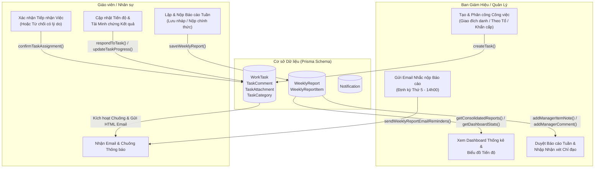

# TÀI LIỆU TOÀN DIỆN: LUỒNG BÁO CÁO CÔNG VIỆC & KẾ HOẠCH NÂNG CẤP HỆ THỐNG (SQMS)

---

## MỤC LỤC
1. [Tổng quan Kiến trúc Hệ thống](#1-tổng-quan-kiến-trúc-hệ-thống)
2. [Cấu trúc Cơ sở Dữ liệu (Database Schema)](#2-cấu-trúc-cơ-sở-dữ-liệu-database-schema)
3. [Luồng Dữ liệu từ Database đến Giao diện (Data Flow)](#3-luồng-dữ-liệu-từ-database-đến-giao-diện-data-flow)
   - [3.1. Phân hệ Điều hành Công việc (WorkTask)](#31-phân-hệ-điều-hành-công-việc-worktask)
   - [3.2. Phân hệ Báo cáo Tuần (WeeklyReport)](#32-phân-hệ-báo-cáo-tuần-weeklyreport)
4. [Mô tả Giao diện & Chức năng cho từng Đối tượng](#4-mô-tả-giao-diện--chức-năng-cho-từng-đối-tượng)
   - [4.1. Giao diện Admin / Ban Giám Hiệu](#41-giao-diện-admin--ban-giám-hiệu)
   - [4.2. Giao diện Giáo viên / Nhân sự](#42-giao-diện-giáo-viên--nhân-sự)
5. [Kế hoạch Chi tiết Nâng cấp & Đề xuất Cải tiến](#5-kế-hoạch-chi-tiết-nâng-cấp--đề-xuất-cải-tiến)
   - [Giai đoạn 1: Giao diện Giáo viên Chuyên biệt (/teacher/cong-viec)](#giai-đoạn-1-giao-diện-giáo-viên-chuyên-biệt-teachercong-viec)
   - [Giai đoạn 2: Tự động Đồng bộ Công việc sang Báo cáo Tuần (Auto-Sync)](#giai-đoạn-2-tự-động-đồng-bộ-công-việc-sang-báo-cáo-tuần-auto-sync)
   - [Giai đoạn 3: Phân cấp Phê duyệt Tổ Chuyên Môn (TTCM)](#giai-đoạn-3-phân-cấp-phê-duyệt-tổ-chuyên-môn-ttcm)
   - [Giai đoạn 4: Dashboard Thống kê KPI & Tỷ lệ Đúng hạn (SLA)](#giai-đoạn-4-dashboard-thống-kê-kpi--tỷ-lệ-đúng-hạn-sla)
   - [Giai đoạn 5: Thông báo Đa kênh qua Microsoft Teams Webhook](#giai-đoạn-5-thông-báo-đa-kênh-qua-microsoft-teams-webhook)

---

## 1. Tổng quan Kiến trúc Hệ thống

Hệ thống quản lý công việc và báo cáo trong hệ thống Skyline SQMS được cấu thành từ hai phân hệ tương hỗ:

1. **Điều hành Công việc (`WorkTask`)** – [`/admin/tasks`](file:///d:/SSM/skyline-survey/src/app/admin/tasks/page.tsx):
   * Quản lý phân công, giao nhiệm vụ từ BGH/Quản lý đến từng nhân sự hoặc tổ/bộ môn.
   * Xử lý xác nhận nhận việc, phản hồi tiến độ, tải biên bản/tài liệu kết quả, thảo luận và cảnh báo trễ hạn.
2. **Báo cáo Tuần (`WeeklyReport`)** – [`/admin/weekly-reports`](file:///d:/SSM/skyline-survey/src/app/admin/weekly-reports/page.tsx):
   * Định kỳ hàng tuần (Thứ 5 trước 14h00), giáo viên/nhân sự tổng hợp các nội dung công việc thực hiện trong tuần, tiến độ đạt được và đề xuất giải pháp khi có vướng mắc.
   * Cấp quản lý/BGH theo dõi báo cáo toàn trường, duyệt từng đầu việc, ghi nhận xét chỉ đạo và trích xuất dữ liệu.



---

## 2. Cấu trúc Cơ sở Dữ liệu (Database Schema)

Chi tiết các bảng dữ liệu cốt lõi trong `prisma/schema.prisma`:

### 2.1. Phân hệ Công việc (`WorkTask`)
```prisma
model WorkTask {
  id               String           @id @default(cuid())
  category         String           // Danh mục công việc
  title            String           // Tên đầu việc
  description      String?          // Mô tả chi tiết yêu cầu
  assignedToRole   String           @default("KT_DBCL") // Giao cho phòng ban/tổ
  assignedToUserId String?          // Giao đích danh 1 nhân sự
  assignedById     String           // Người giao việc (Admin/BGH)
  startDate        DateTime         // Ngày bắt đầu
  endDate          DateTime         // Hạn hoàn thành
  progress         String           @default("PENDING") // PENDING, IN_PROGRESS, COMPLETED, OVERDUE
  acceptanceStatus String           @default("WAITING_CONFIRMATION") // WAITING_CONFIRMATION, ACCEPTED, REJECTED
  acceptedAt       DateTime?        // Thời gian bấm nhận việc
  rejectionReason  String?          // Lý do từ chối nhận việc
  month            Int?             // Tháng thực hiện
  academicYearId   String?          // Năm học
  isImportant      Boolean          @default(false) // Đánh dấu khẩn cấp / quan trọng
  staffNote        String?          // Ghi chú báo cáo của nhân sự
  staffUpdatedAt   DateTime?        // Thời gian nhân sự cập nhật tiến độ
  collaborators    String?          // Danh sách ID người phối hợp (JSON string)
  attachments      TaskAttachment[] // Tệp tài liệu đính kèm
  comments         TaskComment[]    // Bình luận thảo luận
  assignedToUser   User?            @relation("TaskAssignee", fields: [assignedToUserId], references: [id])
  assignedBy       User             @relation("TaskAssigner", fields: [assignedById], references: [id])
  academicYear     AcademicYear?    @relation(fields: [academicYearId], references: [id])
}

model TaskComment {
  id        String   @id @default(cuid())
  taskId    String
  userId    String
  content   String
  createdAt DateTime @default(now())
  user      User     @relation("TaskComments", fields: [userId], references: [id])
  task      WorkTask @relation(fields: [taskId], references: [id], onDelete: Cascade)
}

model TaskAttachment {
  id          String   @id @default(cuid())
  taskId      String
  userId      String
  fileName    String
  fileData    String   // Base64 hoặc URL tệp
  fileSize    Int      @default(0)
  contentType String   @default("")
  createdAt   DateTime @default(now())
  user        User     @relation("TaskAttachments", fields: [userId], references: [id])
  task        WorkTask @relation(fields: [taskId], references: [id], onDelete: Cascade)
}
```

### 2.2. Phân hệ Báo cáo Tuần (`WeeklyReport`)
```prisma
model WeeklyReport {
  id             String             @id @default(cuid())
  userId         String             // Người lập báo cáo
  weekNumber     Int                // Tuần thứ mấy trong tháng (1-5)
  month          Int                // Tháng (1-12)
  year           Int                // Năm
  academicYearId String?            // Năm học
  status         String             @default("DRAFT") // DRAFT, SUBMITTED, REVIEWED
  managerComment String?            // Nhận xét chỉ đạo chung của BGH
  createdAt      DateTime           @default(now())
  updatedAt      DateTime           @updatedAt
  academicYear   AcademicYear?      @relation(fields: [academicYearId], references: [id])
  user           User               @relation(fields: [userId], references: [id])
  items          WeeklyReportItem[] // Danh sách các dòng công việc chi tiết
}

model WeeklyReportItem {
  id               String       @id @default(cuid())
  reportId         String
  mainTask         String       // Hạng mục / Công việc chính
  workContent      String       // Nội dung công việc cụ thể đã làm
  progress         String       @default("NOT_STARTED") // NOT_STARTED, DOING, COMPLETED, NOT_COMPLETED
  proposedSolution String?      // Đề xuất / Giải pháp / Khó khăn vướng mắc
  managerNote      String?      // Ý kiến chỉ đạo riêng của BGH cho mục này
  createdAt        DateTime     @default(now())
  report           WeeklyReport @relation(fields: [reportId], references: [id], onDelete: Cascade)
}
```

---

## 3. Luồng Dữ liệu từ Database đến Giao diện (Data Flow)

### 3.1. Phân hệ Điều hành Công việc (`WorkTask`)
1. **Giao việc**:
   * Admin nhập thông tin trên form tại [`/admin/tasks`](file:///d:/SSM/skyline-survey/src/app/admin/tasks/client.tsx) $\rightarrow$ gọi Server Action [`createTask()`](file:///d:/SSM/skyline-survey/src/app/admin/tasks/actions.ts).
   * Hệ thống ghi bản ghi `WorkTask`, tạo `Notification` trong DB và gửi **Email HTML thông báo** kèm link xác nhận nhanh (`?taskId=...&action=confirm`).
2. **Tiếp nhận & Báo cáo tiến độ**:
   * Người được giao click chuông thông báo hoặc vào màn hình công việc $\rightarrow$ Bấm **Xác nhận nhận việc** (`confirmTaskAssignment`). Hệ thống cập nhật `acceptanceStatus = ACCEPTED` và gửi thông báo phản hồi ngược lại cho người giao việc.
   * Khi thực hiện, nhân sự cập nhật trạng thái (`PENDING` $\rightarrow$ `IN_PROGRESS` $\rightarrow$ `COMPLETED`), điền ghi chú (`staffNote`) và tải tệp nghiệm thu lên `TaskAttachment`.
3. **Quét hạn tự động**:
   * Khi load trang, hệ thống kích hoạt `checkAndNotifyOverdueTasks()` và `checkAndNotifyUpcomingTasks()` gửi cảnh báo nếu công việc sắp hoặc đã quá hạn kết thúc.

### 3.2. Phân hệ Báo cáo Tuần (`WeeklyReport`)
1. **Nhắc nộp định kỳ**:
   * Định kỳ Thứ 5 hàng tuần lúc 14h00, hàm `sendWeeklyReportEmailReminders()` lọc toàn bộ nhân sự chưa có bản ghi `WeeklyReport` trạng thái `SUBMITTED` trong tuần hiện tại để gửi email và chuông nhắc nhở.
2. **Nhập và Nộp báo cáo**:
   * Nhân sự chọn tuần trong tháng (Tuần được tính từ Thứ 2 đến Thứ 6).
   * Điền danh sách các `WeeklyReportItem`: Tên việc chính, nội dung thực hiện, mức độ hoàn thành và đề xuất giải pháp.
   * Bấm **Lưu nháp** (`saveWeeklyReportDraft`) hoặc **Nộp chính thức** (`saveWeeklyReport`).
3. **Duyệt & Chỉ đạo**:
   * BGH vào Tab **Báo cáo tổng hợp** hoặc **Dashboard**, xem toàn bộ báo cáo phân theo từng Tổ chuyên môn / Phòng ban.
   * Ghi nhận xét chỉ đạo chung (`managerComment`) hoặc ghi chú trực tiếp vào từng dòng (`managerNote`).
   * Xuất file Excel định dạng chuẩn.

---

## 4. Mô tả Giao diện & Chức năng cho từng Đối tượng

### 4.1. Giao diện Admin / Ban Giám Hiệu
* **3 Chế độ Xem (Views)**:
  * *List View*: Bảng danh sách đầy đủ, lọc đa chiều (Năm học, Phòng ban, Danh mục, Trạng thái tiếp nhận, Mức độ ưu tiên).
  * *Kanban Board*: Kéo thả trực quan giữa các cột tiến độ.
  * *Timeline View*: Lịch biểu theo dòng thời gian ngày bắt đầu - ngày kết thúc.
* **Bảng điều khiển Báo cáo tuần**:
  * *Tab Dashboard*: Biểu đồ thống kê tỷ lệ hoàn thành, trễ hạn theo phòng ban và theo thời gian.
  * *Tab Báo cáo tổng hợp*: Xem dạng bảng toàn bộ nhân sự theo từng tổ chuyên môn.
  * *Tab Lịch sử*: Tra cứu lại lịch sử báo cáo các tuần trước đó.
  * *Nút Gửi nhắc nộp*: Kích hoạt gửi email nhắc nhở tức thời cho nhân sự chưa nộp.

### 4.2. Giao diện Giáo viên / Nhân sự
* Hộp thông báo chuông và Email trực tiếp với giao diện màu nhận diện mức độ khẩn cấp (`[QUAN TRỌNG]`).
* Nút tiếp nhận việc tức thì chỉ bằng 1 cú click.
* Bảng nhập báo cáo tuần hỗ trợ thêm dòng linh hoạt, sao chép dòng và xem phản hồi của lãnh đạo.

---

## 5. Kế hoạch Chi tiết Nâng cấp & Đề xuất Cải tiến

### Giai đoạn 1: Giao diện Giáo viên Chuyên biệt (`/teacher/cong-viec`)
* **Mục tiêu**: Tách biệt luồng thao tác của Giáo viên khỏi giao diện Admin, tạo trải nghiệm mượt mà và trực quan.
* **Các file thực hiện**:
  * `[NEW]` [`src/app/teacher/cong-viec/page.tsx`](file:///d:/SSM/skyline-survey/src/app/teacher/cong-viec/page.tsx): Server Component xác thực và tải dữ liệu công việc cá nhân.
  * `[NEW]` [`src/app/teacher/cong-viec/client.tsx`](file:///d:/SSM/skyline-survey/src/app/teacher/cong-viec/client.tsx): Client Component gồm 3 tab:
    1. *Việc của tôi (Được giao & Phối hợp)*
    2. *Lập Báo cáo Tuần của tôi*
    3. *Lịch sử Báo cáo & Lời dặn BGH/TTCM*
  * `[MODIFY]` [`src/components/Sidebar.tsx`](file:///d:/SSM/skyline-survey/src/components/Sidebar.tsx): Thêm menu **"Công việc & Báo cáo tuần"** với badge hiển thị số việc cần tiếp nhận.

### Giai đoạn 2: Tự động Đồng bộ Công việc sang Báo cáo Tuần (Auto-Sync)
* **Mục tiêu**: Giáo viên không cần gõ lại thủ công các đầu việc đã làm trong tuần.
* **Các file thực hiện**:
  * `[MODIFY]` [`src/app/admin/weekly-reports/actions.ts`](file:///d:/SSM/skyline-survey/src/app/admin/weekly-reports/actions.ts): Bổ sung hàm `getAutoPopulatedTasksForWeek(userId, weekNumber, month, year, academicYearId)` tìm tất cả `WorkTask` có ngày nằm trong tuần được chọn.
  * `[MODIFY]` [`src/app/admin/weekly-reports/client.tsx`](file:///d:/SSM/skyline-survey/src/app/admin/weekly-reports/client.tsx) & giao diện Teacher: Thêm nút **"⚡ Tự động nạp việc trong tuần"**.

### Giai đoạn 3: Phân cấp Phê duyệt Tổ Chuyên Môn (TTCM)
* **Mục tiêu**: Cho phép Tổ trưởng/Tổ phó chuyên môn xem và nhận xét sơ bộ báo cáo của các thành viên trong tổ trước khi BGH duyệt toàn trường.
* **Các file thực hiện**:
  * `[MODIFY]` [`src/app/admin/weekly-reports/actions.ts`](file:///d:/SSM/skyline-survey/src/app/admin/weekly-reports/actions.ts): Kiểm tra quyền TTCM dựa vào `TeacherDepartmentAssignment` để giới hạn danh sách xem theo Tổ.
  * `[MODIFY]` [`src/app/admin/weekly-reports/client.tsx`](file:///d:/SSM/skyline-survey/src/app/admin/weekly-reports/client.tsx): Thêm bộ lọc nhanh theo Tổ và trường nhận xét cấp Tổ.

### Giai đoạn 4: Dashboard Thống kê KPI & Tỷ lệ Đúng hạn (SLA)
* **Mục tiêu**: Định lượng hiệu suất công việc phục vụ bình bầu thi đua cuối kỳ.
* **Các file thực hiện**:
  * `[MODIFY]` [`src/app/admin/tasks/actions.ts`](file:///d:/SSM/skyline-survey/src/app/admin/tasks/actions.ts): Bổ sung hàm tính tỷ lệ đúng hạn `On-time Completion Rate (%)` và thời gian phản hồi trung bình.
  * `[MODIFY]` [`src/app/admin/tasks/client.tsx`](file:///d:/SSM/skyline-survey/src/app/admin/tasks/client.tsx): Bổ sung các thẻ KPI Cards và biểu đồ phân tích.

### Giai đoạn 5: Thông báo Đa kênh qua Microsoft Teams Webhook
* **Mục tiêu**: Tăng tốc độ phản hồi công việc khẩn cấp.
* **Các file thực hiện**:
  * `[NEW]` [`src/lib/teams-webhook.ts`](file:///d:/SSM/skyline-survey/src/lib/teams-webhook.ts): Module bắn MessageCard vào kênh Microsoft Teams của Tổ thông qua `Department.teamsWebhookUrl`.
  * Kích hoạt tự động khi có công việc khẩn cấp hoặc nhắc nộp báo cáo định kỳ.

---

*Tài liệu được khởi tạo và lưu trữ tại: `docs/BAO_CAO_CONG_VIEC_LUONG_VA_KE_HOACH.md` trong thư mục dự án.*
