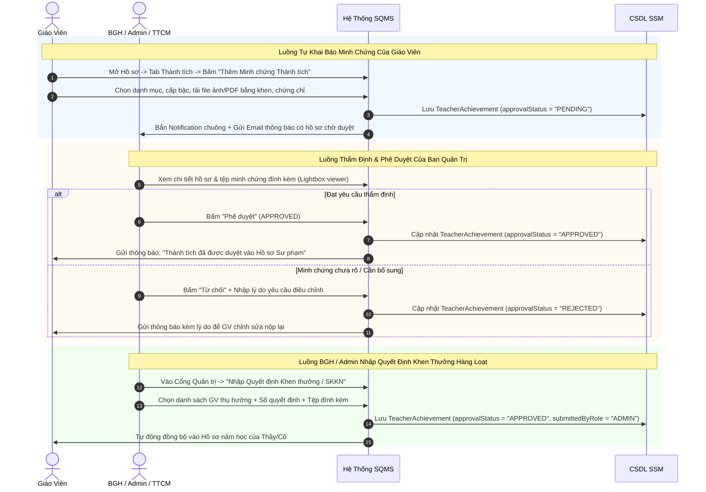
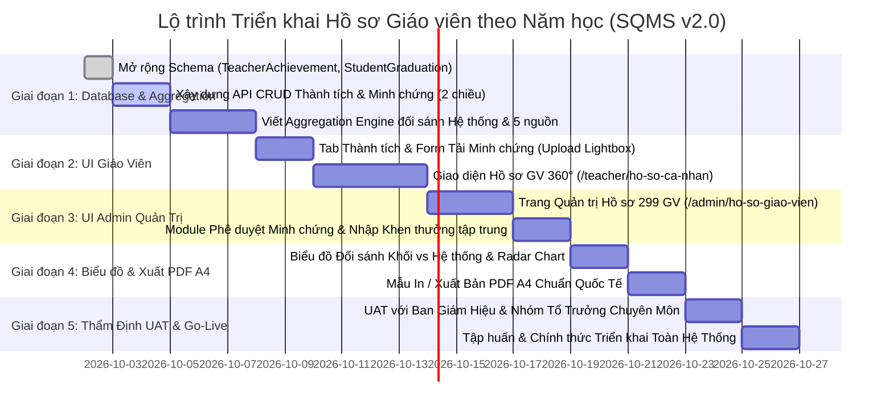

# KẾ HOẠCH CHI TIẾT THIẾT KẾ HỒ SƠ GIÁO VIÊN THEO NĂM HỌC (TEACHER e-PORTFOLIO 360°)
### HỆ THỐNG QUẢN TRỊ CHẤT LƯỢNG GIÁO DỤC SKY-LINE (SQMS)
*Mã tài liệu: SQMS-PLAN-TEACHER-PORTFOLIO-360-V2*  
*Phiên bản: 2.0 - Bổ sung Đối sánh Toàn Hệ Thống, Thành tích Thi HSG, Tỷ lệ Chuyển trường, Xếp loại Năm học & Đậu Tốt nghiệp - Đại học*  
*Cơ sở dữ liệu kiểm toán: SSM SQLite Production-Ready (299 Giáo viên, 1.207 Phân công, 870 Tiết dự giờ, 5.236 Bảng điểm, 1.214 Mục tiêu cố vấn, 633 Lượt chuyển trường, 1.534 Tổng kết học kỳ)*  

---

## MỤC LỤC
1. [Bối Cảnh & Mục Tiêu Chiến Lược Nâng Cấp](#1-bối-cảnh--mục-tiêu-chiến-lược-nâng-cấp)
2. [Rà Soát Thực Trạng Dữ Liệu Hiện Có Trên SSM (Data Audit AS-IS Mở Rộng)](#2-rà-soát-thực-trạng-dữ-liệu-hiện-có-trên-ssm-data-audit-as-is-mở-rộng)
3. [Mô Hình Dữ Liệu Mở Rộng (Database Schema Extensions)](#3-mô-hình-dữ-liệu-mở-rộng-database-schema-extensions)
   - 3.1. Bảng Quản lý Thành tích Giáo viên (`TeacherAchievement`)
   - 3.2. Bảng Theo dõi Tốt nghiệp THPT & Đại học (`StudentGraduationUniversity`)
4. [Biểu Đồ Đối Sánh Chất Lượng Bộ Môn Từng Khối Lớp Với Hệ Thống](#4-biểu-đồ-đối-sánh-chất-lượng-bộ-môn-từng-khối-lớp-với-hệ-thống)
5. [Cấu Trúc Toàn Diện Của Danh Mục "Thành Tích & Đóng Góp Của Giáo Viên"](#5-cấu-trúc-toàn-diện-của-danh-mục-thành-tích--đóng-góp-của-giáo-viên)
   - 5.1. Thành tích Thi đua từ các Kỳ thi của Học sinh do GV phụ trách
   - 5.2. Chỉ số Biến động Sĩ số: Tỷ lệ Chuyển trường & Giữ chân Học sinh
   - 5.3. Tỷ lệ Học sinh đạt Xếp loại Học lực & Khen thưởng Danh hiệu Năm học
   - 5.4. Tỷ lệ Đậu Tốt nghiệp THPT & Trúng tuyển các trường Đại học
6. [Cấu Trúc 6 Phân Hệ Giao Diện Hồ Sơ Giáo Viên 360°](#6-cấu-trúc-6-phân-hệ-giao-diện-hồ-sơ-giáo-viên-360)
7. [Quy Trình Nhập Liệu 2 Chiều (GV Tự Khai Báo & Admin Phê Duyệt)](#7-quy-trình-nhập-liệu-2-chiều-gv-tự-khai-báo--admin-phê-duyệt)
8. [Bộ Công Thức Tính Điểm KPI & Radar Năng Lực Giáo Viên](#8-bộ-công-thức-tính-điểm-kpi--radar-năng-lực-giáo-viên)
9. [Lộ Trình Triển Khai 5 Giai Đoạn](#9-lộ-trình-triển-khai-5-giai-đoạn)

---

## 1. BỐI CẢNH & MỤC TIÊU CHIẾN LƯỢC NÂNG CẤP

Trong công tác quản trị trường học chuẩn quốc tế tại Hệ thống Giáo dục Sky-Line, năng lực và đóng góp của một Giáo viên không chỉ giới hạn ở số tiết dạy hay điểm thi nội bộ, mà được cấu thành từ 4 trụ cột thực chứng:
1. **Chất lượng giảng dạy bộ môn so với Chuẩn toàn Hệ thống**: So sánh kết quả môn học của từng Khối lớp do GV giảng dạy với mặt bằng chung của toàn bộ Hệ thống Sky-Line (tất cả các cơ sở) để thấy rõ mức độ vượt chuẩn hay chênh lệch.
2. **Thành tích bồi dưỡng thế hệ học sinh mũi nhọn**: Tích hợp trực tiếp các giải thưởng từ các kỳ thi Học sinh Giỏi, Olympic, Hội thi NCKH, VEX Robotics, Cambridge... mà học sinh do Thầy/Cô trực tiếp hướng dẫn đạt được.
3. **Mức độ gắn kết & Giữ chân học sinh (Retention)**: Đo lường tỷ lệ học sinh chuyển trường (`StudentTransfer`) của các lớp GV chủ nhiệm/phụ trách, phản ánh niềm tin và sự hài lòng bền vững của Phụ huynh đối với GV.
4. **Đầu ra học thuật cuối cấp**: Tỷ lệ học sinh đạt xếp loại Xuất sắc/Giỏi, khen thưởng danh hiệu năm học, tỷ lệ đỗ 100% Tốt nghiệp THPT và trúng tuyển các trường Đại học danh tiếng trong nước & quốc tế.

---

## 2. RÀ SOÁT THỰC TRẠNG DỮ LIỆU HIỆN CÓ TRÊN SSM (DATA AUDIT AS-IS MỞ RỘNG)

Dữ liệu được kiểm toán trực tiếp từ hệ thống CSDL SSM:

| STT | Phân hệ dữ liệu | Bảng CSDL SSM | Số lượng bản ghi thực tế | Trạng thái tích hợp vào Hồ sơ Giáo viên |
| :---: | :--- | :--- | :---: | :--- |
| **1** | **Hồ sơ Nhân sự Giáo viên** | `Teacher`, `User`, `Department`, `Campus` | **299** GV | Cơ sở liên kết: Mã GV, họ tên, email, cơ sở, tổ chuyên môn, chức vụ. |
| **2** | **Phân công Giảng dạy** | `TeachingAssignment`, `SubjectQuota` | **1.207** phân công | Lưu phân công môn học, lớp, học kỳ, năm học; định mức số tiết dạy chuẩn theo cấp học. |
| **3** | **Dự giờ & Phát triển Chuyên môn** | `ObservationSlot`<br>`ObservationRegistration`<br>`ObservationEvaluation`<br>`TeacherAcademicYearTarget` | • **870** tiết dạy<br>• **880** lượt đăng ký<br>• **634** biên bản đánh giá<br>• **204** chỉ tiêu năm học | Đầy đủ dữ liệu 2 vai trò: GV thực hiện dạy (Host) và GV đi dự giờ đồng nghiệp (Observer) đối sánh định mức năm học. |
| **4** | **NPS & Tín nhiệm PHHS** | `SurveyForm`, `SurveyResponse` | **241** phiếu khảo sát | Điểm NPS ròng (+/-), phân loại Promoter / Passive / Detractor và đánh giá mức độ hài lòng theo từng tiêu chí sư phạm. |
| **5** | **Tần số Phản hồi Phối hợp GVCN** | `AcademicConsultationLog`, `SubjectGradeEntry` | **388** lượt nhật ký | Cơ chế tag `[GVBM_RESPONSE:...]` đo lường thời gian phản hồi (SLA) và hành động hỗ trợ học sinh của GVBM. |
| **6** | **Chất lượng Giảng dạy Bộ môn** | `SubjectGradeEntry`, `SubjectGradeConfig` | **5.236** bản ghi điểm | Đầy đủ điểm số: KSĐN, GK1, CK1, GK2, CK2. **Nền tảng để tính toán đối sánh Khối lớp GV dạy với Toàn Hệ thống**. |
| **7** | **Thành tích Thi đua của Học sinh** | `Achievement`, `StudentAchievement`, `Exam` | • **14** thành tích<br>• Có trường `teacherId` & `examId` | Đã có liên kết giữa học sinh đạt giải với GV hướng dẫn. Tự động kéo về hồ sơ thành tích của Thầy/Cô. |
| **8** | **Biến động Sĩ số / Chuyển trường** | `StudentTransfer` | • **633** lượt chuyển trường<br>• **320** ca chuyển ra ngoài (`OUT`) | Nền tảng đo lường tỷ lệ biến động sĩ số và tỷ lệ giữ chân học sinh (Retention Rate) của lớp GVCN. |
| **9** | **Xếp loại & Khen thưởng Năm học** | `StudentTermSummary` | **1.534** tổng kết kỳ | Lưu xếp loại học lực (Xuất sắc, Giỏi...), khen thưởng danh hiệu cuối năm, tỷ lệ lên lớp (`promoted`). |
| **10** | **Cố vấn Học sinh & Cam kết** | `StudentGoal`, `StudentGoalAction` | **1.214** mục tiêu HS | Đo lường tỷ lệ học sinh đạt kỳ vọng so với mục tiêu cam kết từ đầu năm (`achievementLevel`). |
| **11** | **Tốt nghiệp THPT & Đại học** | `StudentCareerOrientation` (hiện tại) | Đang lưu định hướng nghề nghiệp | **Cần bổ sung bảng chuyên biệt `StudentGraduationUniversity`** để theo dõi trúng tuyển Đại học & đỗ Tốt nghiệp THPT của học sinh Khối 12. |

---

## 3. MÔ HÌNH DỮ LIỆU MỞ RỘNG (DATABASE SCHEMA EXTENSIONS)

### 3.1. Bảng Quản lý Thành tích Giáo viên (`TeacherAchievement`)
Quản lý thành tích cá nhân của GV (GVDG, SKKN, Bằng khen, Chứng chỉ quốc tế):
```prisma
model TeacherAchievement {
  id               String       @id @default(cuid())
  teacherId        String
  academicYearId   String
  
  title            String       // Tên thành tích / SKKN / Bằng khen / Chứng chỉ
  category         String       // "GVDG", "SKKN", "KHEN_THUONG", "CHUNG_CHI_QUOC_TE", "BOI_DUONG_HSG", "KHAC"
  level            String       // "TRUONG", "QUAN_HUYEN", "SO_THANH_PHO", "BO_QUOC_GIA", "QUOC_TE"
  recognitionYear  String       // Niên khóa công nhận (VD: "2026-2027")
  decisionNumber   String?      // Số quyết định khen thưởng / Số hiệu chứng chỉ
  issuingAuthority String?      // Cơ quan cấp (Sở GD&ĐT, Bộ GD&ĐT, Cambridge, Microsoft, Sky-Line...)
  issueDate        DateTime?    // Ngày cấp
  
  proofFiles       String?      // JSON mảng URLs file ảnh/PDF minh chứng
  description      String?      // Tóm tắt nội dung sáng kiến / giải thưởng
  
  submittedByRole  String       @default("TEACHER") // "TEACHER" (GV tự nộp) hoặc "ADMIN" (BGH nhập)
  approvalStatus   String       @default("PENDING") // "PENDING", "APPROVED", "REJECTED"
  reviewedById     String?
  reviewedAt       DateTime?
  rejectionReason  String?
  
  createdAt        DateTime     @default(now())
  updatedAt        DateTime     @updatedAt

  teacher          Teacher      @relation(fields: [teacherId], references: [id], onDelete: Cascade)
  academicYear     AcademicYear @relation(fields: [academicYearId], references: [id], onDelete: Cascade)

  @@index([teacherId])
  @@index([academicYearId])
}
```

### 3.2. Bảng Theo dõi Tốt nghiệp THPT & Trúng tuyển Đại học (`StudentGraduationUniversity`)
Dành cho công tác quản lý đầu ra học thuật Khối 12 và ghi nhận đóng góp của GVCN/GVBM THPT:
```prisma
model StudentGraduationUniversity {
  id              String       @id @default(cuid())
  studentId       String
  academicYearId  String
  
  // Tốt nghiệp THPT
  graduated       Boolean      @default(true) // Đạt tốt nghiệp THPT
  graduationScore Float?       // Điểm xét tốt nghiệp / Điểm tổ hợp thi THPT
  
  // Trúng tuyển Đại học / Du học
  admissionStatus String       @default("TRUNG_TUYEN") // "TRUNG_TUYEN", "DU_HOC", "HOC_NGHE", "KHAC"
  universityName  String       // Tên trường Đại học (ĐH Bách Khoa, RMIT, ĐH Ngoại Thương, Univ of Sydney...)
  majorName       String?      // Ngành trúng tuyển (Khoa học Máy tính, Tài chính, Y Đa khoa...)
  admissionType   String?      // "XET_TUYEN_SOM", "DIEM_THI_THPT", "DANH_GIA_NANG_LUC", "IELTS_PORTFOLIO"
  scholarshipInfo String?      // Học bổng đạt được (VD: "Học bổng 50% toàn khóa")
  country         String?      @default("VIETNAM") // Quốc gia (Việt Nam, Úc, Mỹ, Anh, Singapore...)
  
  createdAt       DateTime     @default(now())
  updatedAt       DateTime     @updatedAt

  student         Student      @relation(fields: [studentId], references: [id], onDelete: Cascade)
  academicYear    AcademicYear @relation(fields: [academicYearId], references: [id], onDelete: Cascade)

  @@index([studentId])
  @@index([academicYearId])
}
```

---

## 4. BIỂU ĐỒ ĐỐI SÁNH CHẤT LƯỢNG BỘ MÔN TỪNG KHỐI LỚP VỚI HỆ THỐNG

### 4.1. Cơ Chế Tính Toán Chuẩn Hệ Thống (System-Wide Benchmark)
Giả sử Thầy Nguyễn Văn A giảng dạy môn **Toán** tại cơ sở Riverside ở 2 khối: **Khối 10** (các lớp 10.1, 10.2) và **Khối 11** (lớp 11.1).
Hệ thống sẽ thực hiện aggregation song song:
1. **Điểm của Giáo viên (Teacher Grade Performance)**:
   - Khối 10 do Thầy dạy: Điểm trung bình = $8.25$ | Tỷ lệ Giỏi-Khá = $86.5\%$
   - Khối 11 do Thầy dạy: Điểm trung bình = $7.90$ | Tỷ lệ Giỏi-Khá = $78.0\%$
2. **Chuẩn Toàn Hệ Thống Sky-Line (System-Wide Benchmark)**:
   - Toàn bộ học sinh Khối 10 học môn Toán trên **toàn hệ thống Sky-Line** (tất cả các campus CS1, CS2, Riverside, Quốc tế):
     Điểm trung bình Hệ thống = $7.65$ | Tỷ lệ Giỏi-Khá Hệ thống = $79.2\%$
   - Toàn bộ học sinh Khối 11 học môn Toán toàn hệ thống:
     Điểm trung bình Hệ thống = $7.80$ | Tỷ lệ Giỏi-Khá Hệ thống = $76.5\%$
3. **Chỉ số Delta Giá trị Gia tăng (Value-Added Delta)**:
   $$\Delta_{\text{Điểm TB}} = \text{Score}_{\text{GV}} - \text{Score}_{\text{Hệ Thống}}$$
   $$\Delta_{\text{Tỷ lệ Giỏi-Khá}} = \text{Rate}_{\text{GV}} - \text{Rate}_{\text{Hệ Thống}}$$
   - *Khối 10*: $\Delta = +0.60$ điểm (Vượt chuẩn hệ thống $+7.8\%$ 🟢)
   - *Khối 11*: $\Delta = +0.10$ điểm (Tương đương chuẩn hệ thống 🔵)

### 4.2. Trực Quan Hóa Trên Giao Diện (Benchmark Visual Chart)
- **Biểu đồ Cột Nhóm Kép (Grouped Bar Chart)**:
  - Trục hoành ($X$): Các Khối lớp GV phụ trách (Khối 6, Khối 7, Khối 8...).
  - Trục tung ($Y$): Điểm trung bình (Thang 10) hoặc Tỷ lệ % Giỏi-Khá.
  - Cột 1 (Màu xanh ngọc Sky-Line `#0284C7`): Lớp do GV phụ trách.
  - Cột 2 (Màu xanh Navy `#1E293B`): Trung bình toàn Cơ sở (Campus Benchmark).
  - Cột 3 (Màu xám ánh bạc `#94A3B8` viền đứt nét): Trung bình Toàn Hệ Thống Sky-Line (System Benchmark).
- **Bộ lọc động**: Xem theo từng kỳ khảo sát (`KSĐN`, `GK1`, `CK1`, `GK2`, `CK2`) hoặc xem lũy kế cả năm.

---

## 5. CẤU TRÚC TOÀN DIỆN CỦA DANH MỤC "THÀNH TÍCH & ĐÓNG GÓP CỦA GIÁO VIÊN"

Phân hệ Thành tích được nâng cấp thành **Trung tâm Vinh danh Sư phạm Đa diện** bao gồm 4 khối thành tích liên thông:

```
┌────────────────────────────────────────────────────────────────────────────────────────┐
│                      DANH MỤC THÀNH TÍCH & ĐÓNG GÓP CỦA GIÁO VIÊN                      │
├──────────────────────────┬──────────────────────────┬──────────────────────────────────┤
│ 1. THÀNH TÍCH KỲ THI HSG │ 2. DUY TRÌ SĨ SỐ         │ 3. XẾP LOẠI & KHEN THƯỞNG        │
│    (HS do GV bồi dưỡng)  │    (Tỷ lệ chuyển trường) │    (Tỷ lệ HS Giỏi / Xuất sắc)    │
├──────────────────────────┴──────────────────────────┴──────────────────────────────────┤
│ 4. ĐẦU RA TỐT NGHIỆP THPT & TRÚNG TUYỂN ĐẠI HỌC (Dành cho GV cấp THPT / Khối 12)       │
├────────────────────────────────────────────────────────────────────────────────────────┤
│ 5. THÀNH TÍCH CÁ NHÂN CỦA GIÁO VIÊN (GVDG, SKKN, Bằng khen, Chứng chỉ Quốc tế)        │
└────────────────────────────────────────────────────────────────────────────────────────┘
```

### 5.1. Thành Tích Thi Đua từ các Kỳ Thi của Học Sinh do GV Phụ Trách
- Tự động quét từ bảng `Achievement` và `ExamStudent` nơi `teacherId = teacher.id`.
- Thống kê chi tiết:
  - Danh sách học sinh đạt giải (Họ tên, Lớp).
  - Tên cuộc thi: Học sinh Giỏi cấp Thành phố/Quốc gia, Olympic Toán Quốc tế (HKIMO, SASMO), VEX Robotics, Cambridge English Challenge, IOE...
  - Giải thưởng: Giải Nhất / Nhì / Ba / Khuyến khích / Huy chương Vàng / Bạc / Đồng.
  - Vai trò của GV: *Giáo viên Trưởng đoàn Bồi dưỡng* hoặc *Giáo viên Chủ nhiệm lớp có HS đạt giải*.

### 5.2. Chỉ Số Biến Động Sĩ Số: Tỷ Lệ Chuyển Trường & Giữ Chân Học Sinh (Retention Rate)
- Tự động tính toán từ bảng `StudentTransfer` (320 ca chuyển trường ra ngoài):
  $$\text{Tỷ lệ Chuyển Trường (Transfer-Out Rate)} = \frac{N_{\text{Chuyển đi}}}{N_{\text{Sĩ số đầu năm}}} \times 100\%$$
  $$\text{Tỷ lệ Giữ Chân Học Sinh (Retention Rate)} = 100\% - \text{Tỷ lệ Chuyển Trường}$$
- Ý nghĩa sư phạm:
  - Tỷ lệ giữ chân cao ($\ge 98\%$) là minh chứng trực tiếp cho chất lượng quản lý lớp học, sự tận tâm của GVCN và niềm tin vững chắc của phụ huynh.
  - Hiển thị phân loại lý do chuyển trường (chuyển công tác/nơi ở của gia đình, đi du học, nguyện vọng cá nhân...) để đánh giá công bằng.

### 5.3. Tỷ Lệ Học Sinh Đạt Kết Quả Xếp Loại & Khen Thưởng Năm Học
- Tự động quét từ bảng `StudentTermSummary` (1.534 bản ghi):
  - **Tỷ lệ Xếp loại Học lực**: % Xuất sắc, % Giỏi, % Khá, % Đạt.
  - **Tỷ lệ Khen thưởng Danh hiệu Năm học**:
    + Danh hiệu *Học sinh Xuất sắc*.
    + Danh hiệu *Học sinh Tiêu biểu*.
    + Danh hiệu *Học sinh Giỏi / Học sinh Tiên tiến*.
  - **Tỷ lệ Hoàn thành chương trình & Lên lớp thẳng**: $\ge 99\%$.
  - **Tỷ lệ Rèn luyện (Hạnh kiểm)**: % Tốt, % Khá.

### 5.4. Tỷ Lệ Đậu Tốt Nghiệp THPT & Trúng Tuyển Đại Học (Khối THPT / Lớp 12)
- Tích hợp từ bảng `StudentGraduationUniversity`:
  - **Tỷ lệ Đậu Tốt Nghiệp THPT**: $100\%$ (Chỉ tiêu chất lượng vàng của Sky-Line).
  - **Tỷ lệ Trúng tuyển Đại học**:
    + Top trường Đại học Công lập trọng điểm (Bách Khoa, Ngoại Thương, Kinh Tế TP.HCM, Y Dược...).
    + Đại học Quốc tế tại Việt Nam (RMIT, VinUni, BUV, Fulbright...).
    + Du học các trường Đại học danh tiếng thế giới (Úc, Mỹ, Anh, Singapore, Canada...).
  - **Tỷ lệ học sinh đạt học bổng Đại học**: Tổng giá trị học bổng mà học sinh lớp GV phụ trách giành được.

---

## 6. CẤU TRÚC 6 PHÂN HỆ GIAO DIỆN HỒ SƠ GIÁO VIÊN 360°

| Phân hệ (Tab) | Trọng tâm hiển thị & Chức năng | Nguồn dữ liệu tích hợp |
| :--- | :--- | :--- |
| **Tab 1: Tổng Quan 360° & Thẻ Năng Lực** | Thẻ định danh sư phạm, Biểu đồ Radar 5 cánh, KPI Scorecard tổng hợp năm học | Aggregation từ tất cả các phân hệ |
| **Tab 2: Giảng Dạy & Đối Sánh Hệ Thống** | Phân công lớp/môn, Ma trận phổ điểm qua các kỳ, **Biểu đồ đối sánh Khối lớp với Hệ thống Sky-Line** | `TeachingAssignment`<br>`SubjectGradeEntry` |
| **Tab 3: Dự Giờ & Chuyên Môn** | Đánh giá tiết dạy (Host) + Tiến độ chỉ tiêu dự giờ đồng nghiệp (Observer) đối sánh định mức năm học | `ObservationSlot`<br>`ObservationEvaluation`<br>`TeacherAcademicYearTarget` |
| **Tab 4: Tín Nhiệm & NPS Phụ Huynh** | Chỉ số NPS ròng, Tỷ lệ Promoters/Detractors, Đánh giá sự hài lòng theo từng tiêu chí sư phạm | `SurveyForm`<br>`SurveyResponse` |
| **Tab 5: Cố Vấn Học Sinh & Phối Hợp** | **Tỷ lệ học sinh đạt kỳ vọng so với mục tiêu** (`StudentGoal`), Tần số phản hồi phối hợp GVCN - GVBM, Nhật ký tư vấn 1-1 | `StudentGoal`<br>`AcademicConsultationLog`<br>`StudentHelpRequest` |
| **Tab 6: Thành Tích, Vinh Danh & Đầu Ra** | • Thành tích thi HSG của học sinh<br>• Tỷ lệ chuyển trường & Giữ chân HS<br>• Tỷ lệ xếp loại & khen thưởng năm học<br>• Tỷ lệ đậu Tốt nghiệp & Đại học<br>• Thành tích cá nhân (GVDG, SKKN, Bằng khen)<br>• **Nút GV tự tải minh chứng & Admin phê duyệt** | `Achievement`<br>`StudentTransfer`<br>`StudentTermSummary`<br>`StudentGraduationUniversity`<br>`TeacherAchievement` |

---

## 7. QUY TRÌNH NHẬP LIỆU 2 CHIỀU (GV TỰ KHAI BÁO & ADMIN PHÊ DUYỆT)



---

## 8. BỘ CÔNG THỨC TÍNH ĐIỂM KPI & RADAR NĂNG LỰC GIÁO VIÊN

Điểm đánh giá năng lực sư phạm toàn diện của Giáo viên được tính theo thang điểm 100 dựa trên 5 trục năng lực:

$$Score_{Total} = 30\% \cdot Điểm_{\text{Giảng dạy (vs Hệ thống)}} + 20\% \cdot Điểm_{\text{Dự giờ}} + 15\% \cdot Điểm_{\text{NPS PHHS}} + 15\% \cdot Điểm_{\text{Cố vấn \& Tần số phản hồi}} + 20\% \cdot Điểm_{\text{Thành tích \& Đầu ra}}$$

Trong đó, tiêu chí tính điểm chi tiết:
1. **Chất lượng Giảng dạy (30đ)**:
   - Điểm trung bình các lớp phụ trách đạt hoặc vượt Chuẩn Hệ thống ($\Delta \ge 0$): 15đ.
   - Tỷ lệ học sinh đạt chuẩn kiến thức bộ môn $\ge 85\%$: 10đ.
   - Mức độ tiến bộ qua các kỳ (Delta cuối kỳ so với đầu năm dương): 5đ.
2. **Dự giờ & Phát triển Chuyên môn (20đ)**:
   - Điểm trung bình các tiết dạy thao giảng $\ge 8.5/10$: 10đ.
   - Hoàn thành $100\%$ chỉ tiêu dự giờ đồng nghiệp theo định mức năm học: 10đ.
3. **Tín nhiệm Phụ huynh NPS (15đ)**:
   - Chỉ số NPS lớp phụ trách $> +60\%$: 10đ.
   - Điểm đánh giá mức độ hài lòng các tiêu chí sư phạm $\ge 4.2/5.0$: 5đ.
4. **Cố vấn Học sinh & Phối hợp (15đ)**:
   - Tỷ lệ học sinh cố vấn đạt mục tiêu cam kết từ đầu năm $\ge 85\%$: 8đ.
   - Tần số & SLA phản hồi phối hợp GVCN trong vòng 48h đạt $100\%$: 7đ.
5. **Thành tích, Vinh danh & Đầu ra (20đ)**:
   - Có học sinh đạt giải HSG / Olympic / Cuộc thi các cấp: 6đ.
   - Tỷ lệ giữ chân học sinh (Retention) $\ge 98\%$ (Tỷ lệ chuyển trường thấp): 5đ.
   - Tỷ lệ học sinh đạt danh hiệu Xuất sắc / Giỏi năm học: 4đ.
   - Đạt $100\%$ đỗ Tốt nghiệp THPT & tỷ lệ đỗ Đại học cao (với GV THPT) HOẶC đạt danh hiệu GVDG / SKKN / Bằng khen / Chứng chỉ quốc tế: 5đ.

---

## 9. LỘ TRÌNH TRIỂN KHAI 5 GIAI ĐOẠN



---
*Tài liệu được cập nhật phiên bản 2.0 đồng bộ 100% với các yêu cầu mở rộng về đối sánh hệ thống, thành tích thi HSG, tỷ lệ chuyển trường, xếp loại năm học và tỷ lệ tốt nghiệp - đại học.*
