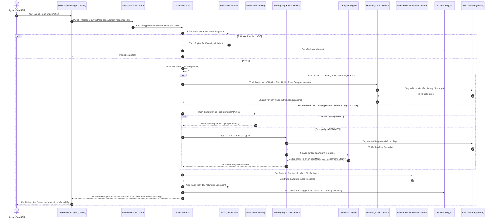

# THIẾT KẾ KIẾN TRÚC ENTERPRISE AI AGENT (SSM AI ASSISTANT ARCHITECTURE)
**Dự án**: Hệ thống Quản trị Chất lượng Giáo dục SSM — Sky-Line Education Group  
**Tác giả**: Senior AI Architect, Senior Full-Stack Engineer, Security & Data Engineer  
**Thời gian**: 2026-09-22  
**Trạng thái**: Hoàn thành Giai đoạn 2 (Phase 2: AI Architecture Proposal)

---

## 1. MỤC TIÊU & NGUYÊN TẮC THIẾT KẾ CỐT LÕI

Kiến trúc **SSM AI Assistant** được xây dựng theo tiêu chuẩn **Enterprise AI Agent** chuyên sâu cho giáo dục, tuyệt đối không phải là chatbot hỏi đáp thông thường:
1. **Kiến trúc Tách biệt (Decoupled Architecture)**: Toàn bộ lõi AI được đóng gói hoàn toàn trong tầng dịch vụ độc lập `src/services/ai/`, tách rời 100% khỏi giao diện React UI và không can thiệp vào logic nghiệp vụ hiện hữu của SSM.
2. **Không Truy cập Database Tùy Tiện**: AI không được cấp quyền chạy câu lệnh SQL động. Mọi hành động lấy dữ liệu phải đi qua:
   $$\text{AI Orchestrator} \longrightarrow \text{Tool Registry} \longrightarrow \text{Permission Gateway} \longrightarrow \text{SSM Data Service} \longrightarrow \text{Prisma Database}$$
3. **Kế thừa Toàn vẹn Phân quyền (Strict RBAC & SBAC)**: AI hoạt động dưới thẩm quyền của tài khoản đang đăng nhập; không được phép có bất kỳ quyền hạn nào vượt quá người dùng hiện tại (vai trò, cơ sở, lớp học, môn học, niên khóa).
4. **Phân tích Định lượng Tất định (Deterministic Analytics Engine)**: LLM không bao giờ tự nhẩm tính điểm số, tỷ lệ hay độ lệch chuẩn. Toàn bộ tính toán thống kê được giao cho **Analytics Engine** chuyên biệt tính toán chính xác 100% trước khi đưa vào ngữ cảnh LLM để diễn giải sư phạm.
5. **Cơ chế Duyệt Thao tác Thay đổi Dữ liệu (Human-in-the-Loop - HITL)**: Giai đoạn 1 chỉ kích hoạt chế độ **READ-ONLY**. Mọi thao tác ghi dữ liệu (WRITE) trong tương lai phải bắt buộc qua quy trình: *Đề xuất Action $\to$ Xem trước Preview $\to$ Người dùng Phê duyệt $\to$ Xác thực lại Phân quyền $\to$ Thực thi $\to$ Ghi vết Audit Log*.

---

## 2. CẤU TRÚC THƯ MỤC DỊCH VỤ (`/src/services/ai`)

```
src/services/ai/
├── orchestrator/          # Bộ điều phối trung tâm tiếp nhận yêu cầu & phân loại Intent
│   ├── index.ts           # Luồng điều phối chính (Orchestrator pipeline)
│   └── intentClassifier.ts# Nhận diện ý định (Intent detection: 14 loại intents chuẩn)
├── rag/                   # Hệ thống Retrieval-Augmented Generation & Quản trị Tri thức
│   ├── index.ts           # RAG Retrieval Service kết hợp lọc siêu dữ liệu & Vector similarity
│   ├── chunker.ts         # Phân đoạn văn bản quy chế thông minh theo ngữ nghĩa sư phạm
│   ├── embedder.ts        # Tạo vector embedding chuẩn hóa
│   └── documentStore.ts   # Quản lý tài liệu tri thức (Metadata, Versioning, Lifecycle)
├── tools/                 # Danh mục 16 Tools nghiệp vụ tiêu chuẩn
│   ├── registry.ts        # Tool Registry tĩnh, kiểm soát định nghĩa & schema tham số
│   ├── executor.ts        # Thực thi công cụ qua Permission Gateway
│   └── implementations/   # Triển khai từng công cụ kết nối services SSM
│       ├── studentTools.ts
│       ├── examTools.ts
│       ├── teacherTools.ts
│       ├── observationTools.ts
│       ├── advisoryTools.ts
│       └── reportTools.ts
├── gateway/               # Tầng Cổng Kiểm soát Phân quyền (Permission Gateway)
│   ├── index.ts           # authorizeAIAction() trung tâm
│   └── scopeValidator.ts  # Thẩm định phạm vi Campus, Class, Subject, Department
├── analytics/             # Bộ máy Tính toán Định lượng Tất định (Deterministic Analytics)
│   ├── index.ts           # Engine thống kê học tập
│   ├── mathStats.ts       # Mean, Median, Mode, StdDev, Min, Max, Percentiles
│   ├── benchmarkStats.ts  # Đánh giá tỷ lệ đạt chuẩn, vượt chuẩn, dưới chuẩn
│   ├── gapAnalysis.ts     # GAP = Actual Score - Target Score & phân nhóm hỗ trợ
│   └── trendAnalysis.ts   # Xu hướng tiến bộ qua các kỳ kiểm tra (KSCL, GK, CK)
├── guardrails/            # Bộ lọc An toàn & Phòng vệ Bảo mật
│   ├── promptSanitizer.ts # Ngăn chặn Prompt Injection & Jailbreak
│   ├── piiMasker.ts       # Ẩn các định danh nhạy cảm (SĐT, Email, CCCD, địa chỉ)
│   └── responseValidator.ts# Kiểm định tính toàn vẹn câu trả lời & phòng chống Hallucination
├── audit/                 # Giám sát, Lưu vết & Kiểm toán AI
│   └── auditLogger.ts     # Ghi nhận chi tiết mọi giao dịch AI vào AIAuditLog
├── providers/             # Quản lý Nhà cung cấp Mô hình Trí tuệ Nhân tạo
│   ├── index.ts           # Provider Factory hỗ trợ Gemini 2.5 Flash & Native Fallback
│   ├── geminiProvider.ts  # Tích hợp Google Generative AI chính thức
│   └── nativeProvider.ts  # Offline Local Engine không phụ thuộc API bên ngoài
├── prompts/               # Quản lý Chỉ dẫn Hệ thống & Persona Chuẩn
│   ├── systemPrompts.ts   # Ràng buộc toàn vẹn dữ liệu và an toàn sư phạm
│   └── rolePersonas.ts    # Persona cho Admin, TBP, TTCM, GV, PHHS, HS
└── types/                 # Toàn bộ định nghĩa TypeScript chuẩn mực cho hệ thống AI
    ├── orchestrator.ts
    ├── tools.ts
    ├── permissions.ts
    ├── rag.ts
    └── audit.ts
```

---

## 3. LUỒNG DỮ LIỆU ĐIỀU PHỐI (END-TO-END DATA FLOW PIPELINE)



---

## 4. HỆ THỐNG PHÂN LOẠI Ý ĐỊNH (INTENT CLASSIFICATION SPECIFICATION)

AI Orchestrator tự động phân loại mọi tương tác thành 1 trong 14 nhóm ý định tiêu chuẩn trước khi quyết định kích hoạt công cụ:

| Mã Intent | Tên Nghiệp Vụ | Yêu Cầu Dữ Liệu / Xử Lý |
|---|---|---|
| `KNOWLEDGE_SEARCH` | Tra cứu Quy định & Chính sách | RAG Metadata Search (Quy chế kiểm tra, định mức dự giờ, tiêu chuẩn benchmark). |
| `SSM_GUIDE` | Hướng dẫn sử dụng phần mềm SSM | RAG Search hướng dẫn quy trình (cách vào điểm, nộp phiếu dự giờ, mở khóa). |
| `STUDENT_QUERY` | Tra cứu thông tin cá nhân học sinh | Tool: `getStudentProfile` (theo phạm vi lớp phụ trách hoặc liên kết phụ huynh). |
| `EXAM_ANALYSIS` | Phân tích kết quả kiểm tra định kỳ | Tool: `getStudentExamResult`, `getClassExamAnalysis` (KSCL, GK, CK). |
| `SUBJECT_ANALYSIS` | Phân tích chất lượng bộ môn | Tool: `getSubjectAnalysis` (Tỷ lệ đạt chuẩn, phổ điểm qua các năm/kỳ). |
| `OBSERVATION_ANALYSIS` | Phân tích hoạt động dự giờ sư phạm | Tool: `getTeacherObservation`, `getObservationAnalysis` (11 tiêu chí, xếp loại). |
| `STUDENT_GOAL` | Quản lý Sổ mục tiêu SMART | Tool: `getStudentGoal` (Mục tiêu học tập, hành động cam kết). |
| `GAP_ANALYSIS` | Đánh giá khoảng cách điểm số & mục tiêu | Tool: `getStudentGapAnalysis` (GAP = Thực tế - Mục tiêu, phân loại hỗ trợ). |
| `SUPPORT_TRACKING` | Theo dõi học sinh diện cần hỗ trợ | Tool: `getStudentSupportTracking` (Cảnh báo Xanh/Vàng/Đỏ, yêu cầu hỗ trợ). |
| `PSYCHOLOGY_TRACKING`| Theo dõi cố vấn tâm lý & sư phạm | Tool: `getPsychologyTracking` (Phiên cố vấn học tập, bảo mật nghiêm ngặt). |
| `EXPERIENCE_ANALYSIS`| Đánh giá hoạt động trải nghiệm | Tool: `getExperienceResult` (Tham gia dự án thực tế, kết quả rèn luyện). |
| `TEACHER_QUERY` | Tra cứu hồ sơ & phân công giáo viên | Tool: `getTeacherProfile` (Danh sách GV trong TCM / Bộ phận). |
| `REPORT` | Tổng hợp báo cáo định kỳ | Tool: `generateReport`, `getAssessmentDashboard` (Báo cáo BGH / Ban ĐHCM). |
| `UNKNOWN` | Câu hỏi chung ngoài phạm vi | Phản hồi lịch sự, định hướng người dùng vào các chức năng cốt lõi của SSM. |

---

## 5. HỆ THỐNG TRI THỨC VÀ RAG (KNOWLEDGE BASE & RAG ARCHITECTURE)

### 5.1. Cấu trúc Mô hình Quản trị Tài liệu Tri thức (`KnowledgeDocument`)
Để đảm bảo tính pháp lý và không bị lỗi thời, mọi tài liệu trong RAG bắt buộc có cấu trúc siêu dữ liệu chặt chẽ:
```prisma
model KnowledgeDocument {
  id            String    @id @default(cuid())
  title         String
  category      String    // REGULATION, PROCESS, SSM_GUIDE, ASSESSMENT, OBSERVATION, ADVISORY
  version       String    // e.g. "1.0", "2.1"
  schoolYear    String    // e.g. "2026-2027"
  effectiveDate DateTime  // Ngày bắt đầu hiệu lực
  expiryDate    DateTime? // Ngày hết hiệu lực (nếu có)
  status        String    @default("ACTIVE") // ACTIVE, DRAFT, ARCHIVED
  roleScope     String    // JSON Array: ["ADMIN", "TEACHER", "PARENT", "STUDENT"]
  campusScope   String    // JSON Array: ["ALL"] hoặc ["CS1", "CS2"]
  source        String    // Số hiệu văn bản hoặc đường dẫn tài liệu
  content       String    // Toàn văn tài liệu gốc
  createdBy     String
  approvedBy    String?
  createdAt     DateTime  @default(now())
  updatedAt     DateTime  @updatedAt
  chunks        KnowledgeChunk[]
}

model KnowledgeChunk {
  id          String   @id @default(cuid())
  documentId  String
  chunkIndex  Int
  content     String
  embedding   String?  // Lưu trữ Vector Embedding (JSON Array format tương thích SQLite)
  tokenCount  Int
  document    KnowledgeDocument @relation(fields: [documentId], references: [id], onDelete: Cascade)
}
```

### 5.2. Nguyên tắc Truy xuất Tri thức (Retrieval Rules)
1. **Lọc Siêu dữ liệu Trước (Pre-filtering)**:
   - `status == "ACTIVE"`
   - `effectiveDate <= currentDate` VÀ (`expiryDate == null` HOẶC `expiryDate >= currentDate`)
   - `schoolYear == currentSchoolYear`
   - `roleScope` chứa vai trò của người dùng hiện tại
   - `campusScope` chứa cơ sở của người dùng hoặc `"ALL"`
2. **So khớp Ngữ nghĩa (Semantic Search)**:
   - Sử dụng Cosine Similarity giữa Vector truy vấn và vector của các chunk đã vượt qua vòng lọc siêu dữ liệu.
3. **Trích dẫn Nguồn bắt buộc (Mandatory Citation)**:
   - Khi trả lời câu hỏi quy chế, AI bắt buộc chỉ rõ: *Tên văn bản, Số hiệu/Phiên bản, Ngày ban hành*.
   - Nếu không đủ tài liệu kiểm chứng: Trả lời rõ ràng *"Hệ thống tri thức SSM hiện chưa có tài liệu quy định về nội dung này"*, tuyệt đối không tự suy diễn.

---

## 6. DANH MỤC 16 TOOLS NGHIỆP VỤ (TOOL REGISTRY SPECIFICATION)

Toàn bộ công cụ được định nghĩa cố định (hardcoded server-controlled), cấm LLM tự sáng tạo công cụ:

| STT | Tên Tool | Phạm vi Phân quyền Yêu cầu | Mô tả Nghiệp vụ |
|---|---|---|---|
| 1 | `searchKnowledge` | Mọi vai trò (theo `roleScope`) | Tra cứu quy định, quy trình, hướng dẫn sử dụng SSM trong RAG. |
| 2 | `getCurrentUser` | Người dùng hiện tại | Xem thông tin danh tính, chức vụ, cơ sở và quyền hạn của chính mình. |
| 3 | `getStudentProfile` | GVCN lớp, GVBM dạy lớp, BGH, PHS con mình | Xem lý lịch học sinh, lớp, cơ sở, người giám hộ. |
| 4 | `getStudentExamResult` | Học sinh (chính mình), PHS (con mình), GV (lớp dạy), BGH | Bảng điểm chi tiết các bài kiểm tra thường xuyên, giữa kỳ, cuối kỳ. |
| 5 | `getClassExamAnalysis` | GVBM lớp dạy, GVCN lớp, TTCM, TBP, BGH | Thống kê phân tích phổ điểm, tỷ lệ đạt chuẩn benchmark của cả lớp. |
| 6 | `getSubjectAnalysis` | TTCM môn, TBP khối, BGH | Báo cáo chuyên sâu về chất lượng bộ môn qua các cơ sở và kỳ thi. |
| 7 | `getStudentGoal` | Học sinh (chính mình), PHS (con mình), GVCN, BGH | Tra cứu Sổ mục tiêu SMART và các hành động cam kết của học sinh. |
| 8 | `getStudentGapAnalysis` | Học sinh, Phụ huynh, GVBM, GVCN, BGH | Tính toán khoảng cách chênh lệch giữa điểm thực tế và mục tiêu đã đặt. |
| 9 | `getTeacherProfile` | TTCM (GV trong tổ), TBP (GV trong bộ phận), BGH | Tra cứu phân công chuyên môn, giảng dạy và phụ trách của giáo viên. |
| 10 | `getTeacherObservation` | Giáo viên (tiết mình), TTCM (tiết trong tổ), BGH | Tra cứu lịch sử dự giờ, điểm đánh giá và các ý kiến đóng góp tiết dạy. |
| 11 | `getObservationAnalysis`| TTCM, TBP, BGH, KT-ĐBCL | Báo cáo phân tích 11 tiêu chí dự giờ sư phạm toàn trường/theo tổ. |
| 12 | `getStudentSupportTracking` | GVCN lớp, BGH, Cán bộ Cố vấn | Danh sách học sinh cảnh báo rủi ro (Xanh/Vàng/Đỏ) và hỗ trợ gỡ rào cản. |
| 13 | `getPsychologyTracking` | GVCN, Chuyên viên Tâm lý, BGH | Theo dõi nhật ký các phiên cố vấn tâm lý học đường (bảo mật cấp cao). |
| 14 | `getExperienceResult` | GV phụ trách HĐTN, GVCN, BGH | Kết quả đánh giá tham gia các hoạt động và dự án trải nghiệm sáng tạo. |
| 15 | `getAssessmentDashboard` | BGH, Ban ĐHCM, Ban KT-ĐBCL | Dashboard tổng quan tiến độ sổ điểm, dự giờ, khảo sát NPS toàn trường. |
| 16 | `generateReport` | TTCM, TBP, BGH, Ban ĐHCM | Xuất dữ liệu tổng hợp phục vụ giao ban chuyên môn và họp phụ huynh. |

---

## 7. BỘ MÁY TÍNH TOÁN ĐỊNH LƯỢNG TẤT ĐỊNH (ANALYTICS ENGINE)

Để giải quyết triệt để rủi ro ảo giác số liệu của AI, **Analytics Engine** được thiết kế như một thư viện thuật toán thuần túy:
- **Các hàm thống kê cơ bản**:
  - `calcMean(scores: number[]): number`
  - `calcMedian(scores: number[]): number`
  - `calcMode(scores: number[]): number[]`
  - `calcStdDev(scores: number[]): number`
  - `calcMinMax(scores: number[]): { min: number, max: number }`
  - `calcPercentiles(scores: number[], percentiles: number[]): Record<number, number>`
- **Các hàm phân tích sư phạm chuyên biệt**:
  - `calcBenchmarkAchievement(scores: number[], benchmark: number)`: Tính tỷ lệ vượt chuẩn, đạt chuẩn và dưới chuẩn.
  - `calcStudentGAP(actualScore: number, targetScore: number)`:
    $$\text{GAP} = \text{Actual Score} - \text{Target Score}$$
    *Phân nhóm*:
    - $\text{GAP} \ge +0.5$: Vượt mục tiêu xuất sắc.
    - $-0.5 \le \text{GAP} < +0.5$: Đạt sát mục tiêu kỳ vọng.
    - $-1.5 \le \text{GAP} < -0.5$: Dưới mục tiêu nhẹ (Cảnh báo Vàng).
    - $\text{GAP} < -1.5$: Khoảng cách lớn (Cảnh báo Đỏ - Cần kích hoạt 7 ngày gỡ rào cản).
  - `calcSubjectAliasMapping(rawSubjectName: string)`:
    Chuẩn hóa các biến thể tên môn (ví dụ: *"Toán"*, *"Môn Toán"*, *"Math"*, *"Toán học"*) về mã định danh chuẩn `TOAN`.

---

## 8. CẤU TRÚC PHẢN HỒI CHUẨN HÓA (STRUCTURED RESPONSE CONTRACT)

Backend API tuyệt đối không trả về chuỗi HTML tự do. Mọi phản hồi đều theo định dạng JSON có cấu trúc nghiêm ngặt:

```typescript
export interface AIAssistantResponse {
  answer: string;                  // Nội dung trả lời định dạng Markdown an toàn
  sources?: Array<{               // Danh sách tài liệu RAG trích dẫn
    documentId: string;
    title: string;
    version: string;
    effectiveDate: string;
  }>;
  toolsUsed: string[];             // Danh sách các công cụ đã được thực thi
  dataContext?: {                  // Ngữ cảnh số liệu đã được Analytics Engine tính toán
    module: string;
    metrics?: Record<string, any>;
    sampleSize?: number;
  };
  suggestedActions: Array<{       // Gợi ý hành động tiếp theo cho người dùng
    label: string;
    actionType: "NAVIGATE" | "QUERY" | "EXPORT" | "PREVIEW";
    payload: any;
  }>;
  warnings?: string[];             // Cảnh báo nghiệp vụ (ví dụ: cảnh báo rủi ro học sinh Đỏ)
  confidence: number;              // Mức độ tin cậy của câu trả lời (0.0 - 1.0)
  traceId: string;                 // Mã định danh duy nhất phục vụ truy vết Audit Log
}
```

---

## 9. GIÁM SÁT VÀ LƯU VẾT BẢO MẬT (AUDIT LOGGING ARCHITECTURE)

Mọi yêu cầu gửi tới AI đều bắt buộc được lưu vết vào bảng `AIAuditLog` trong cơ sở dữ liệu:

```prisma
model AIAuditLog {
  id                 String   @id @default(cuid())
  traceId            String   @unique
  userId             String
  userRole           String
  campusId           String?
  module             String   // e.g. "GRADEBOOK", "OBSERVATION", "ADVISORY"
  intent             String   // e.g. "EXAM_ANALYSIS", "KNOWLEDGE_SEARCH"
  promptLength       Int
  toolCalled         String?
  permissionDecision String   // "APPROVED" | "DENIED" | "SCOPE_RESTRICTED"
  latencyMs          Int
  modelUsed          String   // e.g. "gemini-2.5-flash", "native-engine"
  tokenUsagePrompt   Int?
  tokenUsageCandidate Int?
  isSuccess          Boolean
  errorMessage       String?
  createdAt          DateTime @default(now())

  user User @relation(fields: [userId], references: [id], onDelete: Cascade)
  @@index([userId, createdAt])
  @@index([intent])
  @@index([permissionDecision])
}
```

> **Cam kết Bảo mật**: Bảng `AIAuditLog` tuyệt đối không lưu khóa bảo mật, mật khẩu hoặc dữ liệu định danh nhạy cảm (PII).
