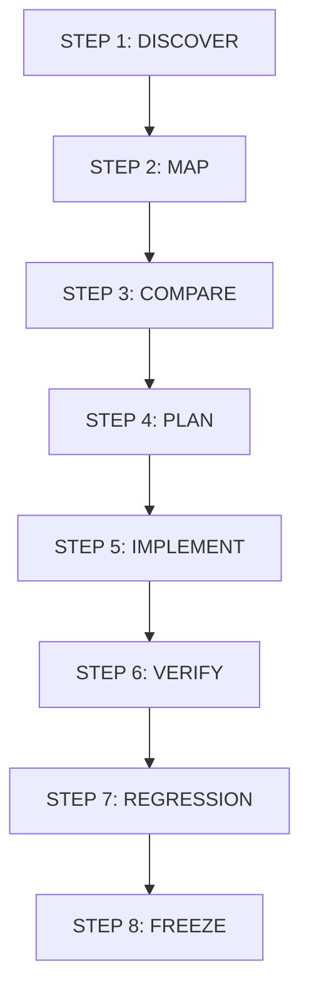

# SSM UI/UX ROLLOUT FRAMEWORK
## Khung Triển Khai Chuẩn Hóa Giao Diện Hệ Thống Quản Trị Giáo Dục Sky-Line (SSM)

---

### 1. TỔNG QUAN & MỤC TIÊU CỐT LÕI

Sau khi hoàn thành xuất sắc giai đoạn **Phase 3 (Foundation)**, **Phase 4 (Pilot Dự giờ & Phát triển chuyên môn)** và **Phase 5 (Post-Pilot Hardening & Readiness)**, hệ thống SSM đã sở hữu một bộ Design System hoàn chỉnh, ổn định và được kiểm chứng trong môi trường thực tế.

**Mục tiêu của Rollout Framework:**
* **Không redesign từng module từ đầu:** Tuyệt đối không xóa bỏ giao diện để viết lại từ con số không gây lãng phí và rủi ro hồi quy.
* **Mô hình triển khai chuẩn:** `Apply validated patterns → adapt to module context → verify → release`.
* **Bảo vệ toàn vẹn nghiệp vụ (Business-First):** Giữ nguyên vẹn 100% Database, Schema, Migrations, API contracts, RBAC, Business Logic và dữ liệu lịch sử.
* **Đồng nhất trải nghiệm người dùng:** Mọi phân hệ của SSM phải hoạt động dưới một ngôn ngữ thiết kế duy nhất (ONE Design System, ONE App Shell, ONE Navigation, ONE Status Language).

---

### 2. NGUYÊN TẮC CỐT LÕI (IMMUTABLE RULES)

1. **Không redesign từ đầu:** Giữ nguyên cấu trúc luồng xử lý và dữ liệu đã được nghiệp vụ kiểm chứng.
2. **Không tạo Design System cục bộ:** Nghiêm cấm mọi hành vi tạo token CSS riêng, palette màu riêng hoặc stylesheet cục bộ ngoài hệ chuẩn `--primary: #003B3A` và semantic tokens.
3. **Ưu tiên Shared Components:** Tái sử dụng tối đa thư viện `src/components/ui/` và `src/components/layout/AppShell.tsx`.
4. **Không thay đổi Backend & Quyền hạn:**
   * Không sửa đổi Database Schema hoặc Prisma schema.
   * Không sửa đổi API endpoint, request body hoặc response contract.
   * Không thay đổi logic phân quyền RBAC hoặc vai trò người dùng (`ALLOWED_ROLES`).
   * Không thay đổi luồng nghiệp vụ phê duyệt nếu chưa có quyết định chính thức từ Hội đồng học thuật / Ban Giám hiệu.
5. **Laptop-First Responsive:** Ưu tiên tối ưu hóa độ phân giải màn hình laptop phổ biến của cán bộ/giáo viên (`1366 × 768` và `1280 × 800`), đồng thời hỗ trợ mượt mà từ tablet (768px - 1024px) đến desktop lớn (1440px+).

---

### 3. MÔ HÌNH ROLLOUT 8 BƯỚC (8-STEP ROLLOUT MODEL)

Mọi phân hệ trong lộ trình triển khai bắt buộc phải tuân thủ nghiêm ngặt chu trình 8 bước:

* **STEP 1 — DISCOVER (Khám phá toàn diện):**
  * Quét toàn bộ mã nguồn module (routes, pages, components, hooks, services, APIs, queries, export/import).
  * Lập danh mục tính năng hiện hữu và ràng buộc kỹ thuật. Tuyệt đối **không sửa code** ở bước này.
* **STEP 2 — MAP (Lập bản đồ thực thi):**
  * Thiết lập ma trận: `Phân hệ → Vai trò người dùng (Roles) → Tác vụ chính → Quy trình nghiệp vụ (Workflow) → Trang (Pages) → Component → Nguồn dữ liệu (Data Source)`.
* **STEP 3 — COMPARE (Đối chiếu & Phân loại):**
  * So sánh từng phần tử với SSM Design System và bài học thực tế từ Pilot Dự giờ.
  * Phân loại 5 nhóm: `KEEP`, `ADAPT`, `REPLACE WITH SHARED COMPONENT`, `MODULE-SPECIFIC`, `REMOVE FROM UI`.
* **STEP 4 — MODULE MIGRATION PLAN (Kế hoạch di chuyển chi tiết):**
  * Lập tài liệu kế hoạch với thứ tự thực thi rõ ràng, rủi ro tiềm ẩn, phương án giảm thiểu và kịch bản test. Phải được phê duyệt trước khi lập trình.
* **STEP 5 — IMPLEMENT (Thực thi chuẩn hóa theo lớp):**
  * Triển khai tuần tự theo 10 lớp: (1) Page Shell → (2) Header → (3) Navigation/Tab → (4) FilterBar → (5) StatusBadge → (6) Main Table/List → (7) DetailDrawer → (8) Forms/Dialogs → (9) Module-specific Visualizations → (10) Responsive Pass.
* **STEP 6 — VERIFY (Kiểm thử kỹ thuật nội bộ):**
  * Chạy Typecheck (`tsc --noEmit`), Lint, Build check, kiểm tra render component và tính đúng đắn của dữ liệu.
* **STEP 7 — REGRESSION (Kiểm thử hồi quy toàn diện):**
  * Kiểm tra tích hợp chéo: API, DB queries, RBAC, business rules, thống kê tính toán, import/export, dữ liệu lịch sử.
* **STEP 8 — FREEZE (Đóng băng & Bàn giao):**
  * Khi đạt 100% tiêu chí QA, đóng băng mã nguồn Wave, cập nhật `UI-DEBT.md` và `KNOWN-ISSUES.md`, gắn nhãn `ROLLOUT VERIFIED` và xin lệnh chuyển Wave.

---

### 4. TÀI LIỆU TIÊU CHUẨN MỖI WAVE

Mỗi phân hệ khi thực hiện bắt buộc phải sản sinh cấu trúc thư mục tài liệu đồng bộ tại `docs/ui-ux-rollout/<module>/`:
1. `00-SUMMARY.md` / `00-DISCOVERY.md`
2. `01-ROLE-MATRIX.md`
3. `02-PAGE-MAP.md`
4. `03-COMPONENT-MAP.md`
5. `04-MIGRATION-PLAN.md`
6. `05-IMPLEMENTATION.md`
7. `06-QA.md`
8. `07-DATA-REGRESSION.md`
9. `08-RBAC.md`
10. `09-KNOWN-ISSUES.md`
11. `10-ROLLOUT-RESULT.md`

---

### 5. QUY TẮC DỪNG (STOP RULE)

* Sau mỗi Wave, quá trình triển khai **BẮT BUỘC DỪNG LẠI**.
* Không tự ý triển khai Wave tiếp theo nếu chưa có lệnh phê duyệt chính thức từ ban quản trị dự án.\n