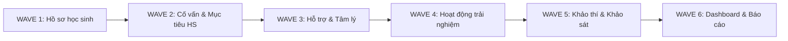

# LỘ TRÌNH TRIỂN KHAI 6 LÀN SÓNG (6-WAVE SEQUENCE)
## Kế hoạch Triển khai Chuẩn hóa UI/UX Toàn diện SSM

---

### 1. NGUYÊN TẮC PHÂN KỲ ROLLOUT

Hệ thống quản trị giáo dục Sky-Line (SSM) bao gồm nhiều phân hệ phức tạp có mối liên hệ dữ liệu mật thiết. Việc triển khai đồng loạt sẽ gây xung đột mã nguồn và rủi ro gián đoạn vận hành nhà trường. Do đó, lộ trình được chia làm **6 Làn Sóng (6 Waves)** độc lập, tuần tự:

---

### 2. CHI TIẾT TỪNG WAVE

| Wave | Phân hệ | Phạm vi / Trọng tâm nghiệp vụ | Vai trò trọng tâm | Thời điểm sẵn sàng |
| :---: | :--- | :--- | :--- | :---: |
| **WAVE 1** | **Hồ sơ học sinh** | Hồ sơ học tập tập trung 360°, thông tin cá nhân, năng lực, kết quả học tập MOET, thành tích, xuất bản PDF & In ấn A4 | BGH, Khảo thí, Giáo vụ, GVCN, Cán bộ CS | **ĐANG BẮT ĐẦU** |
| **WAVE 2** | **Cố vấn học tập & Mục tiêu học sinh** | Phiếu cố vấn định kỳ, thiết lập mục tiêu cá nhân, phân tích khoảng cách GAP (Current vs Target), theo dõi tiến độ học tập | Cố vấn học tập, GVCN, Học sinh | Chờ Wave 1 Freeze |
| **WAVE 3** | **Theo dõi hỗ trợ & Tâm lý học đường** | Lịch sử can thiệp, timeline theo tuần/tháng, đánh giá tiến triển, chuyển giao năm học, bảo mật dữ liệu nhạy cảm | Chuyên viên tâm lý, GVCN, BGH | Chờ Wave 2 Freeze |
| **WAVE 4** | **Hoạt động trải nghiệm** | Quy trình tạo hoạt động (Activity Builder 5 bước), phân công, điểm danh tham gia, vai trò học sinh, đánh giá rèn luyện | BGH, Đoàn Đội, GVCN, GV Bộ môn | Chờ Wave 3 Freeze |
| **WAVE 5** | **Khảo thí & Quản lý đề** | Kế hoạch kiểm tra, ngân hàng câu hỏi, ma trận ma trận đề, khảo sát chất lượng (KSCL), phân bố điểm thi, phân tích phổ điểm | Ban KT&ĐBCL, Tổ trưởng CM, GV ra đề | Chờ Wave 4 Freeze |
| **WAVE 6** | **Dashboard & Báo cáo tổng thể** | Hệ thống Dashboard phân quyền nhận thức vai trò (Role-Aware): GV, TTCM, GĐCS, Ban KT&ĐBCL; biểu đồ trực quan hóa chuẩn | Toàn bộ các cấp lãnh đạo & Giáo viên | Chờ Wave 1-5 Freeze |

---

### 3. ĐIỀU KIỆN CHUYỂN TIẾP WAVE (WAVE GATE CRITERIA)

Một Wave chỉ được xem là hoàn tất và cấp quyền mở Wave tiếp theo khi thỏa mãn đầy đủ các điều kiện:
1. **100% Typecheck & Build PASS:** Không có lỗi biên dịch TypeScript và Next.js.
2. **Data Accuracy Gate:** Dữ liệu tính toán, tổng kết điểm, thống kê không sai lệch 1 bit so với trước khi chuẩn hóa.
3. **Zero API Regression:** Tất cả API contracts giữ nguyên vẹn.
4. **RBAC Strict Enforcement:** Không làm lộ dữ liệu sang các phân quyền khác.
5. **Hoàn thành báo cáo Release Report** với trạng thái `VERIFIED`.
6. **Có lệnh phê duyệt chính thức từ người dùng/chủ quản hệ thống.**\n