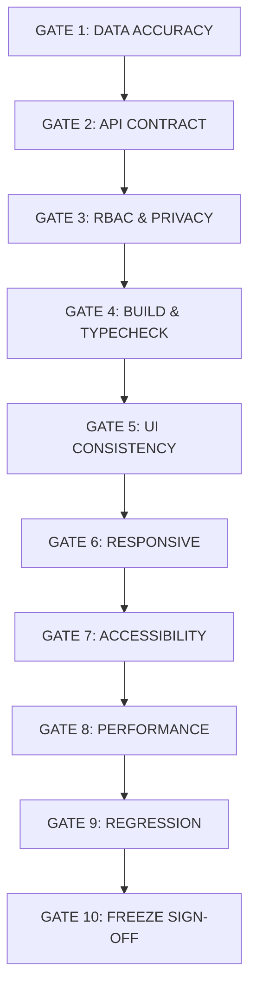

# HỆ THỐNG CỔNG KIỂM THỬ CHẤT LƯỢNG (QA GATES)
## Tiêu chuẩn Đánh giá và Phê duyệt Từng Làn sóng Triển khai

---

### 1. MA TRẬN 10 CỔNG KIỂM THỬ (10 QA GATES)

Trước khi một Wave được công nhận hoàn thành (`VERIFIED`), nó phải vượt qua 100% các cổng kiểm thử sau:

---

### 2. CHI TIẾT CÁC TIÊU CHÍ KIỂM THỬ

#### GATE 1: DATA ACCURACY GATE (Tính Toàn vẹn Dữ liệu) - [TIÊU CHÍ TỬ HUYỆT]
* Đối soát trước và sau khi nâng cấp giao diện: Tổng số học sinh, danh sách lớp, kết quả điểm số MOET, điểm rèn luyện, các nhận xét.
* Không được phép làm mất mát, làm tròn sai, hoặc hiển thị sai lệch bất kỳ chỉ số học tập nào.

#### GATE 2: API GATE (Giữ nguyên Hợp đồng API)
* Toàn bộ API endpoint giữ nguyên: `/api/admin/student-profiles`, `/api/teacher-student-records`, `/api/student-photos/...`.
* Cấu trúc payload gửi đi và response trả về phải giữ nguyên cấu trúc gốc.

#### GATE 3: RBAC & PRIVACY GATE (Phân quyền & Bảo mật)
* Kiểm tra ma trận quyền truy cập theo từng vai trò (`ADMIN`, `GDCS`, `KT_DBCL`, `GIAO_VU`, `GVCN`, `GVBM`).
* Tuyệt đối không để lộ dữ liệu nhạy cảm (thông tin tâm lý, hoàn cảnh gia đình đặc biệt) cho các vai trò không được cấp phép.
* Bảo vệ chống truy cập trái phép bằng URL trực tiếp.

#### GATE 4: BUILD GATE (Độ Sạch Mã Nguồn)
* Biên dịch TypeScript không phát sinh lỗi: `npx tsc --noEmit` đạt Exit code 0.
* Không phát sinh cảnh báo build hoặc lỗi cú pháp React/Next.js.

#### GATE 5: UI CONSISTENCY GATE (Tính Đồng bộ Giao diện)
* 100% nút bấm, ô nhập, hộp chọn, huy hiệu trạng thái sử dụng Shared Component.
* Màu sắc tuân thủ nghiêm ngặt Deep Pine `#003B3A` và Semantic tokens.

#### GATE 6: RESPONSIVE GATE (Hiển thị Đa Thiết bị)
* Kiểm tra hiển thị thực tế trên 6 độ phân giải tiêu chuẩn:
  * 1440px (Desktop màn rộng)
  * **1366px (Laptop giáo viên chuẩn - Trọng tâm)**
  * 1280px (Laptop nhỏ)
  * 1024px (iPad ngang / Tablet lớn)
  * 768px (iPad dọc / Tablet nhỏ)
  * 390px (Mobile thông dụng)

#### GATE 7: ACCESSIBILITY GATE (Khả năng Tiếp cận WCAG AA)
* Độ tương phản văn bản đạt chuẩn WCAG AA (tối thiểu 4.5:1 cho text thường, 3:1 cho text lớn).
* Điều hướng được bằng bàn phím (Tab, Enter, Escape). Focus outline rõ ràng.
* Các ô nhập liệu có nhãn liên kết đầy đủ (`aria-label` hoặc `<label>`).

#### GATE 8: PERFORMANCE GATE (Hiệu năng Tải trang)
* Thời gian chuyển đổi giữa các học sinh và giữa các tab nghiệp vụ < 1.5 giây.
* Ảnh chân dung học sinh có cơ chế tải lười (Lazy loading) và fallback an toàn khi lỗi ảnh.

#### GATE 9: REGRESSION GATE (Kiểm thử Nghiệp vụ Thực tế)
* Kiểm thử đầy đủ các hành động nghiệp vụ cốt lõi:
  * Tìm kiếm và lọc học sinh theo trường/khối/lớp.
  * Xem toàn bộ 9 tab chi tiết.
  * Tải lên và xóa ảnh đại diện học sinh.
  * Tải về tệp PDF hồ sơ học sinh (html2pdf).
  * Mở cửa sổ In ấn A4 (trang in đơn lẻ và in cả lớp).

#### GATE 10: FREEZE GATE (Ký duyệt Đóng băng)
* Xác nhận tài liệu hoàn chỉnh, không còn lỗi P0/P1 tồn đọng.\n