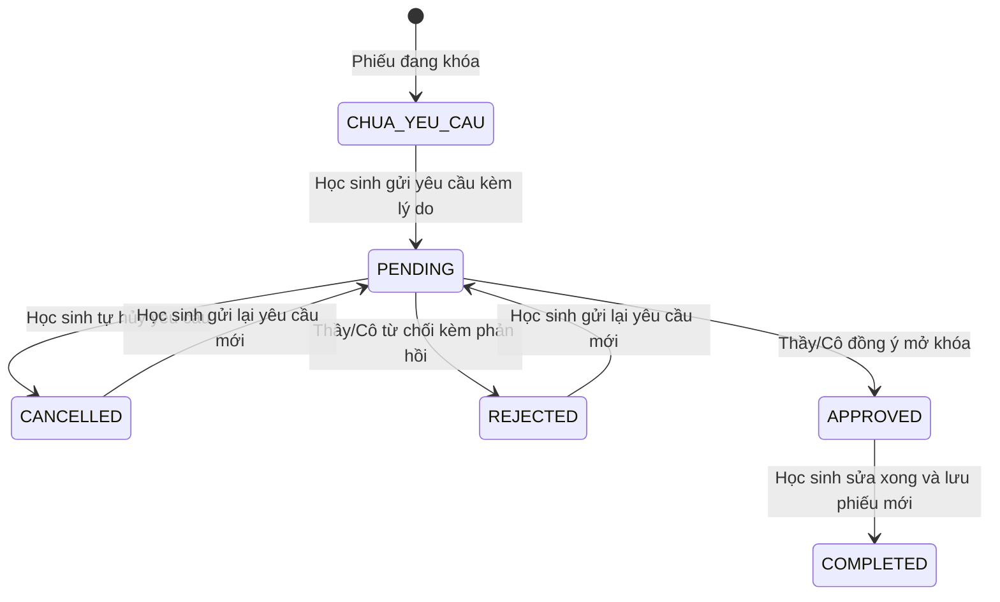

# QUY TRÌNH ĐIỀU CHỈNH PHIẾU (ADJUSTMENT WORKFLOW)
## Cơ Chế Kiểm Soát Sửa Đổi Mục Tiêu và Bảo Lưu Lịch Sử

---

### 1. NGUYÊN TẮC KIỂM SOÁT SỬA ĐỔI

1. **Khóa sau khi nộp (Locked by Default):** Khi học sinh bấm gửi phiếu mục tiêu ở đầu kỳ, phiếu tự động bị khóa để bảo đảm tính nghiêm túc và cam kết rèn luyện.
2. **Không tự mở khóa trực tiếp:** Học sinh không có nút tự mở khóa phiếu của mình trên giao diện.
3. **Phê duyệt bởi Người có thẩm quyền:** Chỉ có Giáo viên Chủ nhiệm (GVCN) hoặc Ban Giám hiệu mới có quyền mở khóa phiếu sau khi xem xét lý do xin điều chỉnh.

---

### 2. CÁC TRẠNG THÁI YÊU CẦU ĐIỀU CHỈNH (REQUEST LIFECYCLE)

---

### 3. THAO TÁC CỦA TỪNG VAI TRÒ

#### 3.1 Dành cho Học sinh:
* Khi phiếu bị khóa, hiển thị nút `[Xin điều chỉnh phiếu]`.
* Mở hộp thoại nhập lý do (tối thiểu 10 ký tự).
* Sau khi gửi, xuất hiện Banner cảnh báo màu vàng: `⏳ Đang chờ GVCN / Ban Giám hiệu duyệt mở phiếu`.
* Học sinh có thể bấm nút `[✕ Hủy yêu cầu]` nếu thay đổi ý định.

#### 3.2 Dành cho Giáo viên Chủ nhiệm:
* Trên màn hình quản lý lớp (`/teacher/co-van-hoc-tap`), tab **"Yêu cầu mở phiếu"** hiển thị danh sách các đơn chờ duyệt.
* Thầy cô đọc lý do của học sinh, chọn:
  * **Đồng ý (APPROVED):** Nhập lời nhắn dặn dò → Phiếu của học sinh chuyển sang trạng thái mở quyền sửa (`isUnlocked: true`).
  * **Từ chối (REJECTED):** Nhập lý do từ chối (VD: Cần trao đổi trực tiếp vào tiết sinh hoạt).\n