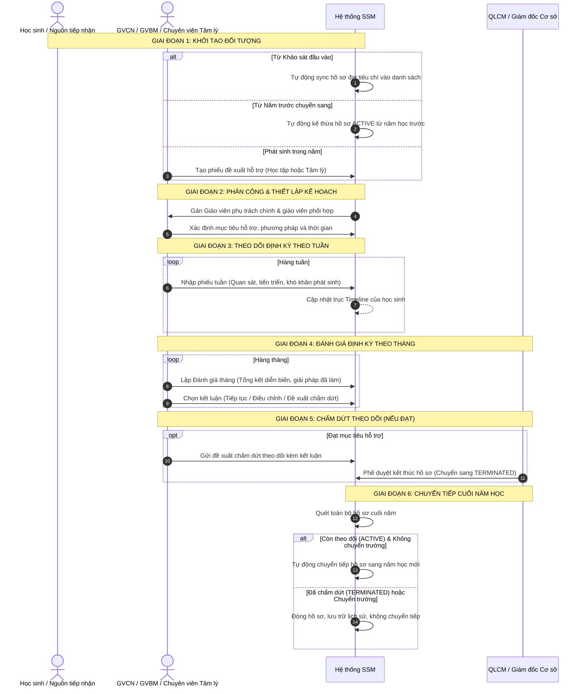

# QUY TRÌNH NGHIỆP VỤ HỖ TRỢ & TÂM LÝ (WORKFLOW)
## Chu Trình 6 Giai Đoạn Từ Tiếp Nhận Đến Chuyển Tiếp Năm Học

---

### 1. SƠ ĐỒ CHU TRÌNH TỔNG QUÁT

---

### 2. QUY TẮC NGHIỆP VỤ TỪNG GIAI ĐOẠN

1. **Khởi tạo đối tượng:**
   * Phải lưu trữ rõ nguồn gốc: `ADMISSION` (Khảo sát đầu vào), `TRANSFERRED` (Năm cũ chuyển sang), `GVCN`, `GVBM`, hoặc `TAM_LY`.
   * Kiểm tra trùng lặp: Một học sinh không được mở cùng lúc 2 hồ sơ cùng loại hỗ trợ trong cùng một năm học.
2. **Theo dõi tuần (Weekly Follow-up):**
   * Phiếu tuần ngắn gọn, ghi nhận nhanh hiện trạng, không bắt buộc nhập lại lý do ban đầu.
3. **Đánh giá tháng (Monthly Review):**
   * Là cột mốc quan trọng để rà soát hiệu quả can thiệp, có kết luận rõ ràng và người chịu trách nhiệm.
4. **Chấm dứt theo dõi:**
   * Bắt buộc có ngày kết thúc, kết luận đánh giá và người phê duyệt có thẩm quyền. Hồ sơ không bị xóa mà lưu trữ vĩnh viễn trong lịch sử.\n